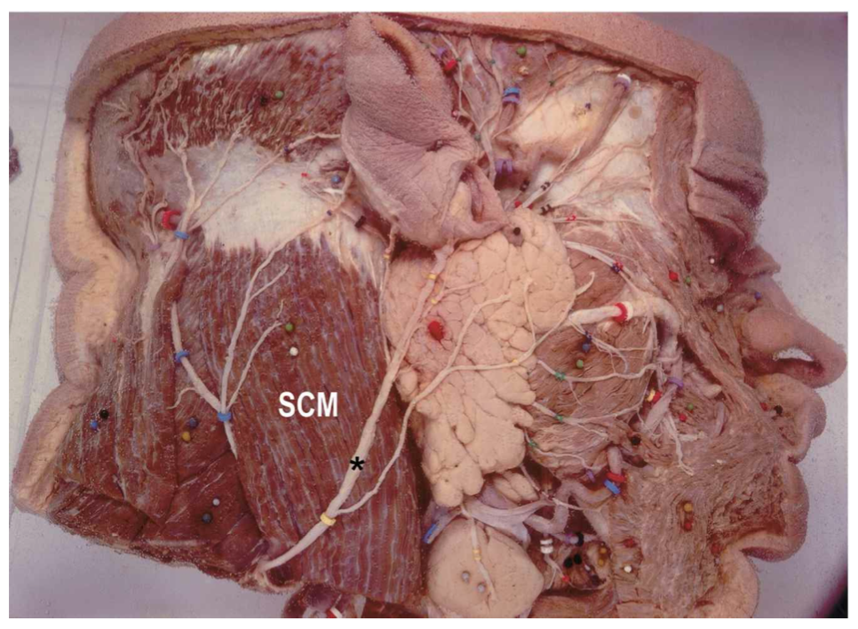
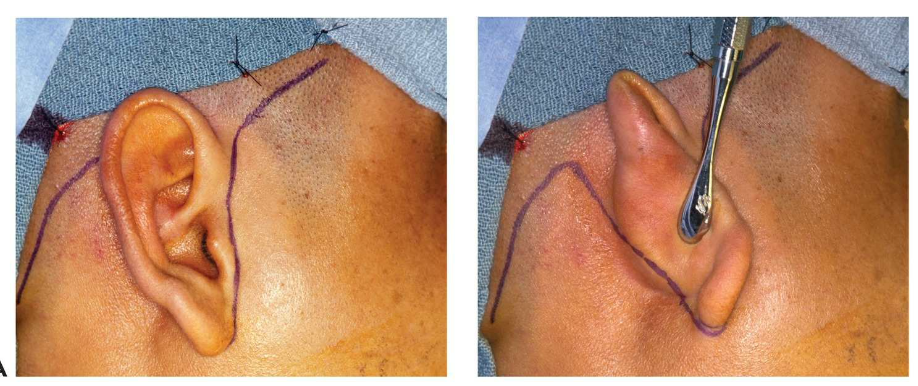
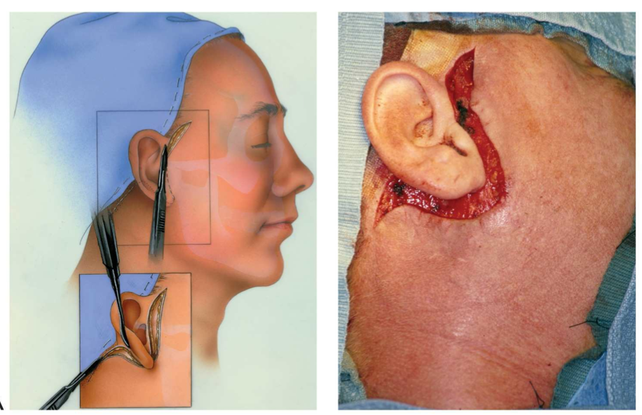
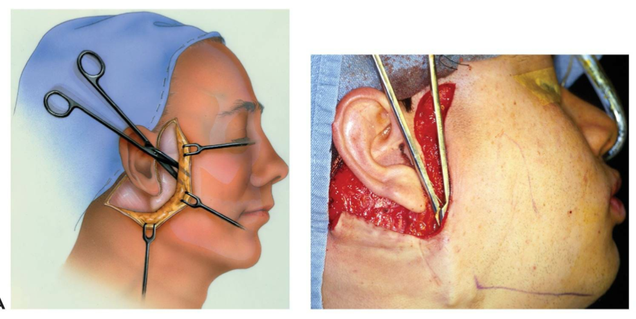
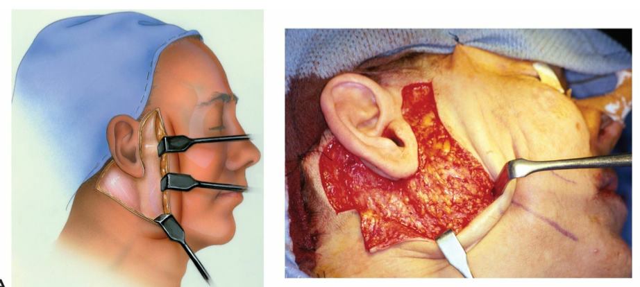
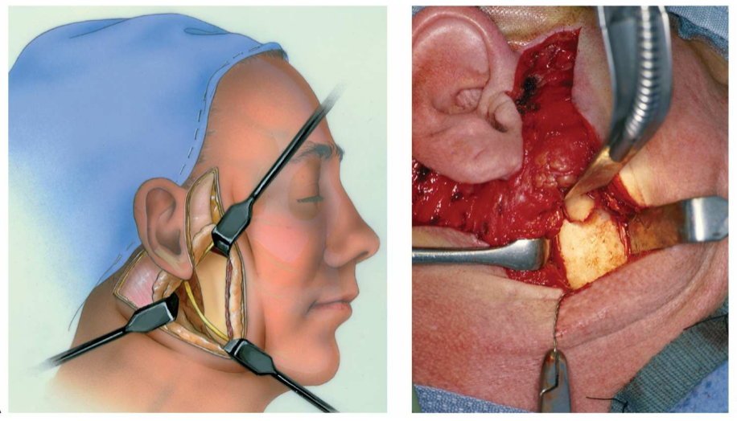

# Chirurgische toegangswegen
## Periorbitaal
### Transcutaan onderste ooglid
### Transconjunctivaal
### Supraorbitaal eyebrow approach
### Bovenste ooglid
## Coronaal
## Transoraal
### Maxilla
### Mandibula langs vestibulair
## Transfaciaal naar de mandibula
### Submandibulair
### Retromandibulair
### Rhytidectomie - Facelift
- Dit is een variant van de retromandibulaire approach. 
  - Enige verschil is dat incisie meer verborgen wordt, diepe dissectie is idem aan retromandibulaire approach
  - Voordeel: mooier litteken
  - Nadeel: langere operatietijd
  
#### Anatomie
Nervus auricularis magnus:

- Sensorische zenuw komende van C2-C3
- Loopt door de diepe fascia van de hals en verschijnt thv midden van de posterieure rand van de m. SCM 
- loopt schuin omhoog in een hoek van 45° richting mandibula
- Enkel bedekt door SMAS en huid 
- Gelegen achter de vena jugularis externa
- Splitst in 2 takken met tak richting oorlel
- Sommige takken lopen door de parotis

```{r echo=FALSE, out.width = "100%", fig.align="center", fig.cap='Nervus auricularis magnus'}

```
#### Stap 1: afdekken
- Breed afdekken
- Oog, hals, hoek van de mond, onderlip en haarlijn moeten zichtbaar zijn

#### Stap 2: markeren en vasoconstrictie
- Eerst markeren
  - 2 cm boven het zygoma net posterieur van de anterieure haarlijn
  - Curve in huidplooi naar posterieur en preauriculair (idem als preauriculaire approach)
  - onder het oor tot 3 mm naar posterieur in huid van het oor en niet in mastoidregio, vervolgens verder omhoog en terug naar beneden achter haarlijn
- Vervolgens infiltratie subcutaan (niet onder platysma zodat facialis niet uitvalt!)

```{r echo=FALSE, out.width = "100%", fig.align="center", fig.cap='Markering rhytidectomie'}

```

#### Stap 3: incisie en dissectie
- Initieel enkel door huid en subcutis
- Liften van huidflap met Metzenbaum
  - Wijd ondermijnen tot onder mandibula en naar anterieur en posterieur
  - Er zijn geen gevaren in dit vlak behalve n. auricularis magnus. Deze ligt diep in het subcutaan vlak
  - Hemostase met bipo

```{r echo=FALSE, out.width = "100%", fig.align="center", fig.cap='Rhytidectomie incisie'}

```

```{r echo=FALSE, out.width = "100%", fig.align="center", fig.cap='Rhytidectomie dissectie'}

```

```{r echo=FALSE, out.width = "100%", fig.align="center", fig.cap='Rhytidectomie dissectie. De flap moet tot onder de mandibula geretraheerd kunnen worden'}

```

#### Stap 4: retromandibulaire approach
- Zodra huidflap is geprepareerd is de approach identiek aan retromandibulaire approach.

```{r echo=FALSE, out.width = "100%", fig.align="center", fig.cap='Retromandibulaire approach'}

```

#### Stap 5: sluiten
- Diepe lagen sluiten zoals in retromandibulaire approach
- Parotiskapsel/SMAS/platysma 
- Vacuumdrain plaatsen in subcutane pocket, exit posterieur van de incisie
- Huid in twee lagen sluiten

## ATM - preauriculair
## Nasaal
### Extern (open)
### Intern (endonasaal)

