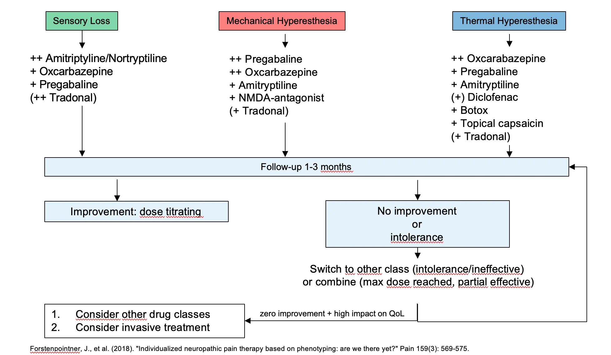

# Medicaties in MKA

## Pijnstilling

### Algemene richtlijnen

-   Paracetamol/NSAIDS met zwakke opioiden = OK
-   Paracetamol/NSAIDS met sterke opioiden = OK
-   Zwakke opioiden met sterke opioiden = NIET OK

### Paracetamol - NSAID's

R/ Paracetamol 1g (co / bruistablet)

-   S/ 4 x 1g /d\
-   S/ 4 x 15mg/kg/dag (kinderen)

R/ Ibuprofen 600mg (co / zakjes)

-   S/ 3 x 600mg/d (max 2.4g/d) (Cave ZS, maagulcera, antico)\
-   S/ 3 x 50mg (6m -- 2j)\
-   S/ 3 x 100mg (2j -- 7j)\
-   S/ 3x 200mg ( \>7j)

R/ Voltaren 75 mg (co / amp. i.m. --inf)

-   S/ 2 x 75 mg/d

R/ Diclofenac 75 mg

-   S/ 2x 75 mg/d

R/ Taradyl (NSAID voor postoperatieve pijn) amp. i.m. -- i.v. : 5 x 10mg
/ 1ml

-   S/ 3 x 30mg/d

### Zwakke opoïden

R/ Tradonal (Tramadol)

-   S/ 100 à 400 mg p.d. in 3 à 4 giften (in 1 à 2 giften voor
    vertraagde vrijstelling)

R/ Contramal (Tramadol) IV

-   S/ 100 à 400 mg p.d. in 3 à 4 giften (in 1 à 2 giften voor
    vertraagde vrijstelling)\
    -- Jonger dan 70j: 3mg/kg oplaaddosis iv, dan 3mg/kg/6u of 10mg/kg
    over 24u\
    -- Ouder dan 70j: 1.5-2mg/kg oplaaddosis iv, dan 1.5-2mg/kg/6u of
    6-8mg/kg over 24u\
    -- Kinderen: 1.5-3mg/kg oplaaddosis iv, dan 1.5-3mg/kg/6u of
    6-10mg/kg over 24u

    -   Voeg litican toe (50 mg 3x/d)

R/ Dafalgan codeïne 500/30

-   S/ tot 3 x p.d. 1 à 2 co

R/ Zaldiar (Tramadol + paracetamol)

-   S/ tot 3 x p.d. 1 à 2 co

R/ Dipidolor

-   S/ 20mg per 6 uur, zo nodig na 3u halve dosis bij geven

    -   Jonger dan 70j: 0.25-0.30mg/kg I.M.\
    -   Ouder dan 70j: 0.15-0.20mg/kg I.M.\
    -   Kinderen: 0.25-0.30mg/kg I.M.

R/ Catapressan (centraal werkend antihypertensivum) (verlengde werking
van Contramal) ook sedatief

-   S/ 1 microgram per kg of 75 microgr oplaaddosis over 15 min +
    catapressan drip

    -   Dag 1 meestal 900 microgram (=6amp) + natriumchloride 0,9% 50ml\
    -   Afbouwschema: 600, 300, 150, stop (telkens over 1 dag)\
    -   Bloeddruk controleren

### Sterke opoïden

R/ Morfine (Morphine HCL Sterop)

-   S/ SC (IV/IM): 10 mg tot max 3x/d

R/ MS Direct

-   S/ 10mg 3 x /dag (/4u) ( vertraagd = 20mg /12u)

R/ Durogesic (Morfine)

-   S/ 1 pleister per 72u + Movicol!

### Neuropathische pijn

#### Acuut zenuwletsel

-   Befact forte: 1 co/day for 1 month
-   Neurobion: 1 IM injection every week for 6 weeks
-   Corticosteroids (Medrol PAK)

|       | Ochtend  | Middag   | Avond    |
|:------|:---------|:---------|:---------|
| Dag 1 | 2 x 4 mg | 2 x 4 mg | 2 x 4 mg |
| Dag 2 | 2 x 4 mg | 2 x 4 mg | 1 x 4 mg |
| Dag 3 | 2 x 4 mg | 2 x 4 mg | /        |
| Dag 4 | 2 x 4 mg | 1 x 4 mg | /        |
| Dag 5 | 2 x 4 mg | /        | /        |
| Dag 6 | 1 x 4 mg | /        | /        |

: Medrol 4 mg PAK schema

| Dag 1         | Dag 2         | Dag 3         | Dag 4         | Dag 5         | Dag 6         | Dag 7         |
|:--------------|:--------------|:--------------|:--------------|:--------------|:--------------|:--------------|
| 64 mg Medrol® | 64 mg Medrol® | 64 mg Medrol® | 64 mg Medrol® | 32 mg Medrol® | 16 mg Medrol® | 8 mg M edrol® |

: Medrol high dose schema 1 week. Praktisch schrijf je best tabletten
van 32 mg voor. Deze zijn deelbaar.

|        | Ochtend | Middag | Avond |
|:-------|:--------|:-------|:------|
| Week 1 | 64 mg   | /      | /     |
| Week 2 | 32 mg   | /      | /     |
| Week 3 | 16 mg   | /      | /     |

: Medrol high dose schema 3 weken. Praktisch schrijf je best tabletten
van 32 mg voor. Deze zijn deelbaar.

#### Chronisch neuropathische pijn

```{r echo=FALSE, fig.cap='Flowchart voor patiënten met neuropathische pijn'}

```

|              | 's morgens | 's avonds  |
|:-------------|:-----------|:-----------|
| Dag 1-3      | /          | 1 x 75 mg  |
| Dag 4-7      | 1 x 75 mg  | 1 x 75 mg  |
| Dag 8-14     | 1 x 75 mg  | 1 x 150 mg |
| Vanaf dag 15 | 1 x 150 mg | 1 x 150 mg |

: Lyrica® (Pregabaline)

If there is sufficient pain relief with a lower dose, you do not need to
increase it further. If excessive side effects occur, you must take a
step back. (The reverse order must be respected when phasing out.)

|            | Morning    | Noon       | Evening    |
|:-----------|:-----------|:-----------|:-----------|
| Day 1-3    | /          | /          | 1 x 300 mg |
| Day 4-6    | 1 x 300 mg | /          | 1 x 300 mg |
| Day 7-9    | 1 x 300 mg | 1 x 300 mg | 1 x 300 mg |
| Day 10-12  | 1 x 300 mg | 1 x 300 mg | 2 x 300 mg |
| Day 13-15  | 2 x 300 mg | 1 x 300 mg | 2 x 300 mg |
| Day 16-... | 2 x 300 mg | 2 x 300 mg | 2 x 300 mg |

: Neurontin® (Gabapentine)

If there is sufficient pain relief with a lower dose, you do not need to
increase it further. If excessive side effects occur, you must take a
step back. (The reverse order must be respected when phasing out.)

|           | Morning   | Noon | Evening   |
|:----------|:----------|:-----|:----------|
| Day 1-7   | /         | /    | 1 x 10 mg |
| Day 8-14  | /         | /    | 1 x 10 mg |
| Day 15-31 | 1 x 10 mg | /    | 1 x 10 mg |

: Redomex® Optie 1 (Amitryptiline)

|           | Morning   | Noon | Evening   |
|:----------|:----------|:-----|:----------|
| Day 1-7   | /         | /    | 1 x 25 mg |
| Day 8-14  | 1 x 25 mg | /    | 1 x 25 mg |
| Day 15-31 | 1 x 25 mg | /    | 2 x 25 mg |

: Redomex® Optie 2 (Amitryptiline)

If there is sufficient pain relief with a lower dose, you do not need to
increase it further. If excessive side effects occur, you must take a
step back. (The reverse order must be respected when phasing out.)\
ATTENTION: this medication reduces the effect of oral contraception.
Consult your doctor for more information

|           | Morning   | Noon | Evening   |
|:----------|:----------|:-----|:----------|
| Day 1-7   | /         | /    | 1 x 25 mg |
| Day 8-14  | /         | /    | 2 x 25 mg |
| Day 15-31 | 1 x 25 mg | /    | 2 x 25 mg |

: Nortrilen® Optie 1 (Nortriptyline)

|           | Morning   | Noon | Evening   |
|:----------|:----------|:-----|:----------|
| Day 1-7   | /         | /    | 2 x 25 mg |
| Day 8-14  | 1 x 25 mg | /    | 2 x 25 mg |
| Day 15-31 | 2 x 25 mg | /    | 2 x 25 mg |

: Nortrilen® Optie 2 (Nortriptyline)

If there is sufficient pain relief with a lower dose, you do not need to
increase it further. If excessive side effects occur, you must take a
step back. (The reverse order must be respected when phasing out.)
ATTENTION: this medication reduces the effect of oral contraception.
Consult your doctor for more information

|           | Morning    | Noon       | Evening    |
|:----------|:-----------|:-----------|:-----------|
| Day 1-3   | /          | /          | 2 x 100 mg |
| Day 4-6   | 1 x 100 mg | /          | 2 x 100 mg |
| Day 7-9   | 2 x 100 mg | /          | 2 x 100 mg |
| Day 10-12 | 2 x 100 mg | 1 x 100 mg | 2 x 100 mg |
| Day 13-15 | 2 x 100 mg | 2 x 100 mg | 2 x 100 mg |

: Tegretol® Optie 1 (Carbamazepine)

|           | Morning    | Noon       | Evening    |
|:----------|:-----------|:-----------|:-----------|
| Day 1-7   | /          | /          | 1 x 200 mg |
| Day 8-14  | 1 x 200 mg | /          | 1 x 200 mg |
| Day 15-31 | 1 x 200 mg | 1 x 200 mg | 1 x 200 mg |

: Tegretol® Optie 2 (Carbamazepine)

If there is sufficient pain relief with a lower dose, you do not need to
increase it further. If excessive side effects occur, you must take a
step back. (The reverse order must be respected when phasing out.)
ATTENTION: this medication reduces the effect of oral contraception.
Consult your doctor for more information

|           | Morning    | Noon | Evening    |
|:----------|:-----------|:-----|:-----------|
| Day 1-7   | 1 x 300 mg | /    | 1 x 300 mg |
| Day 8-14  | 1 x 600 mg | /    | 1 x 300 mg |
| Day 15-31 | 1 x 600 mg | /    | 1 x 600 mg |
| Day 32-39 | 1 x 600 mg | /    | 2 x 600 mg |

: Trileptal® (Oxcarbazepine)

#### Combineren van neuroleptica

| Pre gabali n/gaba pentin co mbined with:         | CDC ra ting of sc ient ific evid ence | RCTs testing the com b ination                      | Clinical practice experience concerning combinations                                                                                                                                                     |
|:-------------------------------------------------|:--------------------------------------|:----------------------------------------------------|:---------------------------------------------------------------------------------------------------------------------------------------------------------------------------------------------------------|
| TCAs                                             | I + A                                 | Gilron et al10 and Holbech et al11                  | Combination well documented. Most with peripheral NeP. Useful combination for patients who do not tolerate either drug in larger doses, as well as sedative effect from TCA to improve sleep disturbance |
| SNRIs                                            | I/II + B/C                            | Tesfaye et al12 and Ta n nenberg et al13            | Combination reasonably well documented. Used by some of the experts with good effect and fewer side effects than with TCA                                                                                |
| SSRIs                                            | III + C                               | None                                                | Insufficient evidence available. SSRIs not relevant in the treatment of NeP                                                                                                                              |
| Op ioidsa                                        | I + B                                 | Gilron et al16, Hanna et al17 and C araceni et al18 | Good evidence to support combination therapy. Frequently used in daily clinical practice                                                                                                                 |
| Other ant iepile pticsb (Na+ c hannel blo ckers) | C                                     | None                                                | Insufficient evidence available. Combination could work in theory due to different mechanisms of action. Limited clinical experience                                                                     |
| Cut aneous p atches                              | I + A/C                               | Casale et al,19 Meier et al20 and Irving et al21    | Mixed evidence and results for localized NeP. Patches add-on to oral therapy are used by some experts with good effect                                                                                   |
| Others                                           | C                                     | None                                                | Insufficient evidence and clinical practice available                                                                                                                                                    |

: Combineren van neuroleptica

<Notes:aIncluding> synthetics.bMainly sodium channel blockers, but also
multiple mode of action drugs (valproic acid and topiramate).

Abbreviations: CDC, Centers for Disease Control and Prevention; NeP,
neuropathic pain; RCTs, randomized controlled trials; SNRIs,
serotonin-noradrenaline reuptake inhibitors; SSRIs, selective serotonin
reuptake inhibitors; TCAs, tricyclic antidepressants

## Antibiotica

[AB-gids UZ
Leuven](https://files.uzleuven.be/antibioticagids/2019/index.html)

### Principes van verantwoord therapeutisch antibioticagebruik

**1. Verwijderen van de oorzaak en drainage van collecties is primair,
antibiotica zijn adjuvante therapie**

-   "Source control" is het fysiek verwijderen van geïnfecteerd
    materiaal zoals pus, necrotisch weefsel, bacteriële colonisaties en
    vegetaties, en vreemde voorwerpen.\
-   De meeste hoofd-hals infecties worden veroorzaakt door
    abces-vormende gram-positieve coccen en anaeroben, is het mechanisch
    draineren van natuurlijke holten (sinus, neus, orbita) en gevormde
    abcessen vaak noodzakelijk.

**2. Selectie van empirische antibiotica begint met een goede
differentieel diagnose, inclusief vermoedelijke bacteriële infecties**

-   Opstellen van een gedetailleerde differentieel diagnose van de
    toestand van de patiënt\

-   Antibiotica dient enkel gegeven te worden indien er mogelijks een
    invasieve bacteriële infectie aanwezig is\

-   "Common pitfalls"

    -   Overschatten van de kans op een bacteriële infectie, en het
        gevaar van het niet of laattijdig behandelen. Bijkomend is er
        een onderschatting van de mogelijke gevaren van
        antibioticagebruik (20% ervaart bijwerkingen!)
    -   Een positieve kweek/cultuur in de afwezigheid van symptomen, is
        géén bewijs van een infectie. Dit is zeker zo bij stalen uit
        niet-steriele plaatsen (vb. mondholte).

**3. Zelfs in een patiënt met bacteriële infectie, behandel deze enkel
indien de therapie het klinisch verloop verandert**

-   Antibioticatherapie maakt steeds deel uit van een veralgemeend,
    rationeel behandelplan voor de patiënt\

-   Bv.: osteomyelitis bij chronisch geëxposeerd bot

    -   persisterende antibioticatherapie kan niet rationeel zijn indien
        een flap-herstel geïndiceerd is
    -   Een korte kuur voor omliggende cellulitis kan wel geïndiceerd
        zijn, maar dient niet chronisch verlengd te worden met oog op
        monotherapie voor de osteomyelitis

**4. Behandel empirisch deze micro-organismen die de aandoeningen
veroorzaken in de differentieel diagnose**

-   Gebruik zo veel mogelijk de lokale richtlijnen (zie antibioticagids
    UZ Leuven), maar durf hiervan afwijken in specifieke klinische
    situaties\
-   Het spectrum moet slechts zó breed zijn dat het de micro-organismen
    in de differentieel diagnose dekt\
-   Bv. Amoxicilline-clavulaanzuur dekt de meeste orale pathogenen,
    Piperacilline-Tazobactam ook maar is te breed voor eerste lijn\
-   Kijk naar de klinische setting: nosocomiale infecties worden vaker
    veroorzaakt door resistente pathogenen en Pseudomonas of andere
    non-fermenterende gram-negatieven, terwijl dit bij
    "community-acquired" infecties niet zo is

**5. Hanteer een lagere drempel voor empirische therapie in ernstig
zieke patiënten**

-   Evalueer de algemene medische toestand van de patiënt en schat de
    dringendheid van nodige zorgen in\
-   Op spoedgevallen: overleg tijdig met urgentie-arts, infectiologie of
    intensieve zorgen

**6. Gastheerfactoren bepalen het spectrum van empirische therapie door
een shift in de mogelijke oorzakelijke micro-organismen**

-   Bij immuungecompromiteerde patiënten moet prompt de differentieel
    diagnose van mogelijke oorzakelijke micro-organismen verbreed
    worden\
-   Neutropene patiënten hebben een verhoogd risico op acute pyogene
    bacteriële micro-organismen en invasieve mycosen\
-   Patiënten met T-cel deficiënties hebben een verhoogd risico op
    chronische infecties door atypische pathogenen (tuberculose,
    cryptococcen, ...)
-   Patienten met deficiënties van de humorale immuniteit (ook verworven
    B-cel defecten, vb. auto-immuunaandoeningen door therapie met
    Rituximab!) hebben vaker infecties door omkapselde bacteriën\
-   Cave: het is NIET zo dat immuungecompromiteerde patiënten vaker
    infecties krijgen met antibiotica-resistente micro-organismen

**7. Farmacokinetische-farmacodynamische principes kunnen de optimale
therapie beïnvloeden**

-   Bacteriëmie wordt behandeld met antibiotica die een hoge
    plasma-concentratie hebben, terwijl infecties van weefsels behandeld
    worden met antibiotica met een groot distributievolume

-   Bot-infecties worden klassiek behandeld met intraveneuze antibiotica

    -   Echter, verschillende antibiotica bereiken eenzelfde
        concentratie in bot om osteomyelitis te behandelen als IV
        antibiotica: TMP-SMX, clindamycine, linezolid, rifampicine,
        metronidazole
    -   In specifieke indicaties (vb. acute osteomyelitis) kunnen orale
        antibiotica even effectief zijn als IV antibiotica, met minder
        bijwerkingen en risico's zoals catheter-infecties

-   Beta-lactam antibiotica zijn tijdsafhankelijke antibiotica

    -   Voornamelijk de tijd boven de MIC (minimal inhibitory
        concentration) bepaalt de effectiviteit van werking
    -   Bij deze antibiotica is het nuttig om de infusie-tijd te
        verlengen terwijl de piek-concentraties afgevlakt worden

-   Aminoglycosiden zijn concentratie-afhankelijke antibiotica

    -   Adjuvante therapie met gentamycine/amikacine wordt slechts 1x
        per dag gegeven, om een zo hoog mogelijke piek te bereiken
    -   Cave: lage zuurstofspanning en pH in abcessen inactiveert
        aminoglycosiden, waardoor deze niet gebruikt kunnen worden in de
        behandeling van abcessen

-   Sommige antibiotica hebben een non-lineaire dosis farmacokinetiek
    (vb. Levofloxacine, Rifampicine)

**8. De-escaleer de antibioticatherapie obv. microbiologie resultaten,
klinische en biochemische respons**

-   Na de start van empirische therapie dient deze aangepast te worden
    adhv verschillende factoren

1.  Het al dan niet aantonen van een specifieke bacteriële oorzaak.
    Microscopie en cultuur zijn vaak voldoende om de therapie te
    de-escaleren, zelfs zonder sensitiviteitstesten. Zelfs bij negatieve
    culturen kan therapie aangepast worden (vb. het niet kweken van MRSA
    verantwoordt het stoppen van empirisch Vancomycine)
2.  Klinische respons op de therapie. Symptomen en biomarkers moeten
    binnen 1-2 dagen drastische verbetering tonen. Koorts, leukocytose
    en CRP worden klassiek opgevolgd en gebruikt om respons op therapie
    te beoordelen. Recent wordt ook het gebruik van procalcitonine meer
    gebruikt.

**9. Als de therapie niet werkt, overweeg dan eerst "source control" en
alternatieve diagnoses vóór antibioticaresistentie en het escaleren van
de therapie**

-   Klinische en biochemische respons op de therapie moet gezien worden
    binnen 1-2 dagen. Indien niet, dienen onderstaande oorzaken
    uitgesloten te worden
-   Er is geen adequate "source control" bekomen, vb abces is niet
    volledig gedraineerd, vreemd lichaam in situ
-   Heeft de patiënt wel een bacteriële infectie? Herevalueer de
    differentieel diagnose en geef aandacht aan aandoeningen die een
    infectie kunnen nabootsen
-   Er bestaan verschillende niet-infectieuze oorzaken van koorts, zoals
    medicatie-geïnduceerde koorts, maligniteit, reumatologische
    aandoeningen, ...

**10. De duur van de therapie moet evidence-based zijn, en zo kort als
mogelijk**

-   Volg de lokale richtlijnen (antibioticagids UZ Leuven) waar
    mogelijk, maar durf afwijken in specifieke situaties

-   Korte kuren (vb. tot 2 dagen geen koorts meer) hebben een aantal
    voordelen tov langdurige kuren

    -   Voor vele indicaties is er geen slechtere outcome aangetoond
    -   Verminderd risico op bijwerkingen
    -   Verminderd risico op aantasting van het microbioom, vooral bij
        kinderen en jongvolwassenen, met minder risico op superinfectie

### Verantwoordelijke kiemen

-   Staph. Aureus
-   Aërobe en anaërobe streptokokken
-   Anaërobe gram-negatieve bacillen

### Profylaxe bij majeure chirurgie?

-   Ingrepen met openen van farynxmucosa zonder bijkomende
    risicofactoren

    -   Cefazoline 2g IV bij inductie (kinderen: cefazoline 50 mg/kg
        IV). Nadien op tijden 8u en 16u

-   Ingrepen met openen van farynxmucosa met bijkomende risicofactoren

    -   Augmentin 1g, 4dd

    -   Risicofactoren:

        -   Na radiotherapie
        -   Slechte algemene toestand, inclusief diabetes
        -   Grote tumor T3-T4 waarvoor grote resectie en
            flapreconstructie
        -   Voorafgaande tracheotomie en dus kolonisatie van de
            luchtwegen

-   Orale approach

    -   Amoxiclav 1g, 4dd

-   Transcutane approach

    -   Cefazoline 2 g IV pre-operatief

### Profylaxe bij kleine mondheelkunde?

Profylactisch gebruik van antibiotica voorafgaand aan invasieve
mondheelkundige ingrepen is gewettigd bij patiënten met:

-   Noodzaak tot endocarditisprofylaxis
-   Patiënten met de ziekte van Rendu-Osler-Weber die ook een pulmonale
    arterioveneuze malformatie vertonen, dienen antibioticaprofylaxie te
    krijgen bij tandheelkundige interventies om hersenabcessen te
    vermijden.
-   Hemodialyse of na een niertransplantatie
-   Hemofilie
-   Sickle cell anemie
-   Slecht gecontroleerde insuline-dependente diabetes mellitus
-   Systemische lupus erythematosus
-   Patiënten met een chirurgisch aangelegde shunt tussen systeem en
    longcirculatie
-   Immuungecompromitteerd zijn door medicatie (monoclonale antistoffen,
    langdurige corticosteroïden
-   Immunosuppressie na kanker of chemotherapie
-   Immunosuppressie na HIV/aids
-   Splenectomie bij volgende primaire aandoeningen: Cooley's anemie;
    Wiskott-Alrich syndroom -- histiocytosis -- vetstapelingsziektes.
-   Radiotherapie in het hoofd-hals gebied
-   Onder bisfosfonaten of denosumab (botresorptie-inhibitoren)
-   Sommige syndromen, bv. Kartagener syndroom met primaire ciliaire
    dyskinesie waarbij mucussekreet ophoopt en recidiverende bovenste
    luchtweginfecties ontstaan, oa recidiverende sinusitis, otitis,
    rhinosinusitis

### Endocarditisprofylaxe

Endocarditisprofylaxe wordt énkel gegeven bij hoog-risicopatiënten die
een hoog-risico ingreep ondergaan. De twee voorwaarden moeten SIMULTAAN
voorkomen.

1.  Hoog risico-patiënten bij wie endocarditisprofylaxe is geïndiceerd,
    zijn patiënten met:

-   kunstkleppen of prothetisch materiaal voor klepherstel (zowel
    biologische als mechanische kleppen, met inbegrip van hemogreffen)

-   die ooit een bacteriële endocarditis hebben doorgemaakt

-   met congenitale hartdefecten:

    -   cyanotische congenitale hartafwijkingen zoals shunt of banding
        bij pulmonalisatresie, Fallot, tricuspidalisatresie,
        univentriculair hart, die niet of slechts gedeeltelijk behandeld
        zijn. Inbegrepen zijn palliatieve shunts en verbindingen
    -   congenitale hartafwijkingen die hersteld werden met prothetisch
        materiaal of toestel, hetzij chirurgisch geplaatst hetzij via
        endovasculaire interventie
    -   Herstelde congenitale hartafwijkingen met residueel defect nabij
        prothetisch luik of toestel (verhindert endotheel vorming)
    -   harttransplantatie met ontstaan van klepaantasting

2.  Hoogrisico ingrepen:

-   preventie wordt ingesteld bij zowel tandheelkundige, respiratoire,
    gastro-intestinale als urogenitale ingrepen
-   hoog-risico-ingrepen in de gelaatshuid betreffen ingrepen in
    geïnfecteerd (huid)weefsel zoals incisie van een huidabces en
    ontlasten van een furunkel.
-   hoog-risico-ingrepen in de tandheelkunde betreffen alle
    tandheelkundige ingrepen die gepaard gaan met chirurgische
    manipulatie van het tandvlees, chirurgische manipulaite van de
    periapicale regio bv. instrumenteren doorheen het foramen apicale of
    bij perforatie van mondmucosa, bij tandextracties, bij verwijdering
    van wortelresten en alle overige MKA-ingrepen.

Eerste keuze:

-   Amoxicilline (penicilline-derivaat) per os

    -   Kind: 50mg/kg
    -   Volwassene: 2g

Alternatief:

-   Ampicilline IM of IV

    -   Kind: 50mg/kg
    -   Volwassene 2g

Tweede keuze: bij niet IgE-gemedieerde penicilline-allergie

-   Cefalexine

    -   Kind: 50mg/kg
    -   Volwassene: 2g

-   Cefadroxil

    -   Kind: 30mg/kg
    -   Volwassene: 2g

Derde keuze: bij IgE gemediëerde penicilline-allergie

-   Clindamycinde per os

    -   Kind: 20mg/kg
    -   Volwassene: 600mg

-   Clarithromycine of azithromycine per os

    -   Kind: 40mg/kg
    -   Volwassene: 2g

### Oncologie (profylaxe)

-   Bij extra-orale approach: 2g cefazoline IV bij inductie, nadien op
    tijden 8u en 16u cefazoline 2g IV (indien OK tijd zo lang duurt).
-   Bij intra- en extra-orale approach: amoxi-clav 4x 1g IV elke 6u
-   Bij grote resecties en reconstructies: amoxi-clav 1g IV om de 4u
    (6g/dag). Te starten 2u voor de ingreep en te continueren gedurende
    3 dagen
-   Indien reeds radiotherapie in het verleden: amoxi-clav 4x 1g IV om
    de 6u (4g/dag). Te starten 2u voor de ingreep en te continueren
    gedurende 7 dagen

### Schisischirurgie (profylaxe)

Standaard:

-   Augmentin bij inductie volgens gewicht en vervolgens te continueren
    3x daags voor 7 dagen bij schisis (10 dagen indien bevuilde wonde,
    slechte mondhygiëne, precaire wondheling etc).
-   Bij minimaal invasieve procedures en goede prognose wondheling (vb
    kleine lipsluiting): Augmentin start bij inductie volgens gewicht en
    nadien te continueren 3x daags voor 3 dagen

Alternatief (vb bij peni-allergie):

-   Bij inductie cefazoline 2 g IV (kinderen cefazoline 50 mg/kg IV)
-   Nadien op tijden 8u en 16u cefazoline 2 g IV
-   Verder gedurende 6 dagen na de ingreep cefazoline 2 g IV 3x/dag

### Implantologie

-   Amoxicilline 2g in te nemen 2 uur voor de ingreep (R/Amoxicilline 1
    g DT/8 co), uitnemen na de ingreep: 2 co/d
-   Azithromycine 500 mg in te nemen 2u voor de ingreep (bij
    peni-allergie)

### Uitgebreide infecties -- flegmones (therapeutisch)

Probeer steeds een antibiogram te bekomen! Wat zijn de oorzakelijke
kiemen?

-   Enterische gram-negatieven
-   Anaeroben
-   Gram-positieven

Eerste lijn antibiotica:

-   B-Lactamase producerende kiem

    -   R/ Amoxiclav 875 mg, Dt: caps. d.t.d. no. 20, S/ Driemaal daags
        1 capsule. Kuur afmaken.\

-   Anaerobe kiemen

    -   R/ Metronidazol 500 mg (Flagyl), Dt: tab. d.t.d. no. 20, S/
        Driemaal daags 1 tablet. Kuur afmaken.

==\> Combinatie van bovenstaande

Alternatieven:

-   Levofloxacine 500 mg 1 co/d (Tavanic) + metronidzazole 500 mg 3 co/d
    (Flagyl)
-   Vancomycine 15-20 mg/kg elke 8-12 uur (max 2g/dosis). Bloedspiegels
    te bepalen!
-   Moxifloxacine 400mg 1 co/d (Avelox)

### Parotitis (therapeutisch)

-   Cefuroxim 500 mg 3 co/d + metronidazole 500 mg 3 co/d, 14 dagen

## Magistrale bereidingen

### Preventiebeleid mucositis bij kankerbehandelingen die mucositis kunnen uitlokken

-   Goede mondhygiëne:

    -   Tandsanering voor start bij voorkeur via eigen tandarts, liefst
        minstens 1 week voor start therapie
    -   Basis mondzorg: goed poetsen, zachte tandenborstel,
        fluoride-houdende tandpasta, tong reinigen, flossen indien
        ervaring, gebitsprothese reinigen
    -   Steeds navragen of er bloedend tandvlees is bij tanden poetsen;
        indien ja moet de patiënt altijd verwezen worden naar
        stomatologie vooraleer de behandeling te starten.
    -   Bij specifieke situaties met zeer hoog risico (bvb bestraling
        van de mondholte, stamceltransplantatie, ... ) moet de patiënt
        ook steeds naar MKA verwezen worden.

-   Indien xerostomie: oral balance (formularium UZ; gel werkt beter dan
    spray) of ander kunstspeeksel (bvb Dentaid Xerios) of suikervrije
    kauwgom

-   Mondspoelmiddel:

    -   Perioaid 0.05% 2x/d opstarten; mag langdurig gebruikt worden.
        Dit vermijdt de mucositis op zich niet, maar zorgt dat er minder
        bacteriële (sur)infectie kan komen ; perio-aid 0.12% bestaat ook
        , maar maximaal 14d gebruiken bij infectie)
    -   Indien perioaid niet goed verdragen wordt (smaakverandering,
        tandverkleuring) eventueel verdunnen of desnoods vervangen
        worden door fysiologisch water 2x/d.
    -   Isobetadine mondspoeling 2x/d is ook een mogelijkheid
    -   Geen duidelijke indicatie voor NaCO3 mondspoelmiddelen

-   Bij smaakverlies evt. zinktabletten voorschrijven: Zinkgluconaat 30
    mg à rato van 1 tablet per dag gedurende één maand.

-   Bij Afinitor: overweeg preventief dexamethasone spoeling 0.5 mg/5 ml
    zonder alcohol

    -   Voorschrift : 50 mg dexamethasone + Xanthaangom excipiens ad 500
        ml (eindconc = 0.1mg/ml)

        -   Ter info: xanthaangom excipiens bevat: methylhydroxybenzoaat
            150mg/propylhydroxybenzoaat
            30mg/natriumsaccharine/xanthaangom 664mg/vloeibare
            sorbitol/propyleenglycol/glycerine/framboos aroma/water ad
            100ml

    -   S/ 4x/d spoelen gedurende 2 minuten en dan minstens 1u nuchter ;
        gedurende 2 maanden en dan op indicatie.

    -   Voorlopig enkel via thuisapotheek te maken; aanvraag MFC
        lopende.

    -   Als er toch schimmelinfectie zou optreden kan Nilstat toegevoegd
        worden (dosis 100 000 IE/1 ml, posologie 4\*/dag 400 000 à 600
        000 IE4 x p.d. 400.000 à 600.000 IE4 x p.d. 400.000 à 600.000
        IE)

-   Bij chemotherapie met hoog risico op mucositis: ijsblokjes in mond
    tijdens toediening

-   Mondinspectie tijdens behandeling

### Behandeling mucositis bij kankerbehandelingen

-   Stomatitis cocktail:

    -   Bevat lidocaine (hogere dosis: 5 mg/ml)\*, difenhydramine\

    -   Indicatie: bij beperkte mucositis of bij langdurig gebruik

    -   Voorschrift:

        -   binnen UZ (gehospitaliseerde pt): : LidocaïneHCl 500mg,
            DifenhydramineHCl 100mg, Xanthaangom met frambozenaroma tot
            100 ml.
        -   ambulant: LidocaïneHCl 500mg/DifenhydramineHCl
            100mg/Propyleenglycol 2 ml/ Hydroxypropylmethylcellulose 0,4
            gr/Gedistilleerd water ad 100 ml (hier geen xanthaamgom
            gezien de mondspoeling dan niet terugbetaald is)
        -   S/ 6x/dag 1 soeplepel langdurig spoelen, mag indien nodig
            ingeslikt worden

-   Mucositis cocktail van radiotherapie "uitwendig gebruik"

    -   R/

        -   Hydrocortisone 200mg
        -   Lidocaïne 400mg
        -   Nistatine 100 000 E/ml 30 ml
        -   Propyleenglycol 10ml
        -   Hydroxypropylmethylcellulose 2g
        -   Gedestilleerd water 500ml

    -   DT/ 1 fles

    -   S/ 6x spoelen per dag met 1 soeplepel onverdund gedurende 2
        minuten, waarvan 3x inslikken

    -   Voorlopig enkel via thuisapotheek te maken; aanvraag MFC
        lopende.

-   Low Level Lasertherapie: niet bij radiotherapie geïnduceerde
    mucositis in de mond

    -   wel nuttig en effectief indien goed toegepast bij chemo

-   Systemische pijnstilling: zo nodig

-   Mondinspectie tijdens behandeling: bij letsels die niet verbeteren
    of pijn moeilijk onder controle: verdacht voor andere oorzaak, evt.
    wisser of biopsie

**Opmerking** Dosis lidocaine varieert bij verschillende pijnstillende
mondspoelmiddelen van 0,5 mg/ml tot 6 mg/ml; geen duidelijke
wetenschappelijke voorkeur voor specifieke dosis.

### Mucositis-cocktail bij gehospitaliseerde patiënten

-   Volgens de laatste LKI-richtlijnen en iom apotheek dient een
    aanpassing te gebeuren bij het magistraal voorschrijven van
    mucositiscocktail ivm wat in de cursus MKA staat.

    -   In de specifieke context van radiotherapie-geïnduceerde orale
        mucositis bij orale tumoren is een formule beschikbaar met 200mg
        Hydrocortisone.

    -   Tijdens hospitalisatie: Hydrocortisone 40 mg, Lidocaine HCl 500
        mg, Difenhydramine HCl 100 mg, Xantaagom exipiëns tot 100 ml (in
        EMV magistraal voor te schrijven, max 3x per dag inslikken)

    -   Ambulant: Hydrocortisone 160 mg, Lidocaine HCl 2000 mg,
        Difenhydramine HCl 400 mg, Xanthaangom 2400 mg,
        Parahydroxybenzoaat 0.08 g, Methylparahydroxybenzoaat 0.32 g,
        Gezuiverd water ad 400 g, Fsa mondspoeling

        -   S/ 6x/dag, 1 soeplepel onverdund, lang spoelen in de mond,
            Inslikken 3 keren op 6 (opm hier geen xanthaangomexipiens
            omdat er anders geen terugbetaling is, max 400 ml anders
            geen terugbetaling)

Veranderingen zijn:

-   De dosis lidocaïne is in deze richtlijn opgehoogd naar 500 mg/100ml
    ipv 400mg op 500ml zoals in de cursus beschreven opdat de patiënten
    meer analgetisch effect zouden hebben.
-   Ook is de Nistatine uit de mucositiscocktail gehaald omdat dit niet
    alleen nefast is voor de smaak maar ook voor de chemische
    stabiliteit van de bereiding. Daarom wordt in dit geval Nilstat 100
    000U/ml mondpsoelmiddel aangeraden te geven juist voor toediening
    van de mucositiscocktail, zodat de dekking aanwezig is en de
    stabiliteit van de magistrale bereiding bewaard

Praktisch voor de ASO's kun je dit in het EMV aanvragen door:

-   Eerst moet je in het EMV onder magistrale bereiding hydrocortisone
    40 mg instellen.
-   Dan "+" drukken
-   Dan mondspoelmiddel intikken om mondspoelmiddel + lidocaïne aan te
    duiden aan 3x 10 ml

### Pijnstillende mondspoeling bij mondulcera of aften

R/

-   Tetracyclinehydrochloride 0,5%
-   NaCarboxyMethylCellulose 1%
-   Vit A 0,5 g
-   Sirupus simplex 30 cc
-   Aqua Menthol ad 100 cc

DT/ 1 fles 100 cc\
S/ 3x/dag gedurende 2 min. in mond houden, niet doorslikken

Nota bene:

-   Eventueel kan men toevoegen: lidocaïne 0,5%
-   Bij kinderen wordt de tetracycline vervangen door erythroforte 1%

### Pijnstillende mondspoeling bij mondulcera of aften ovv spray

R/

-   Tetracyclinehydrochloride 0.5%
-   Vit A 0.5g
-   Aqua menthol ad 100cc
-   Clobetasolpropionaat 75mg
-   Hydroxymethylcellulose 1%

Opmerkingen van de apotheek:

-   De clobetasolpropionaat geeft in sprayvorm een erg slechte smaak,
    dit is op te lossen door de patiënt na gebruik van de spray
    chocolade te laten eten.
-   NaCarboxyMethylCellulose interageert met tetracyclinehydrochloride
    en wordt daarom vervangen door hydroxymethylcellulose

### Pijnstillende mondspoeling bij mondulcera of aften: sterkere variant

R/

-   Clobetasolproprionaat 75mg\
-   Alcohol 96% 30 ml\
-   Natriumedetaat 50 mg\
-   Sorbitol 70% 100 ml\
-   Frambozenessence 6 druppels\
-   Solutio methylparabeni conc FNA 2 ml\
-   Aqua ad 300 cc

DT/ 1 fles 300 cc\
S/ 3x/d mond spoelen zonder in te slikken

### Pijnstilling bij aften

R/

-   Lidocaine 2% orale gel FNA

DT/ flacon 30 ml\
S/ Naar behoefte 4 à 6x per dag de pijnlijke plekken aanstippen met een
wattendepper.

R/ zilvernitraatstift R/ EMLA crème, 4-6 dd aanstippen met
wattenstaafje, of 30 minuten voor het eten aanbrengen.

### Behandeling van aften middels lokale steroïden:

R/ Triamcinolon 0.1% in hypromellosezalf 20% FNA
(Triamcinolonacetonidemondpasta 0,1% FNA) of in oculentum simplex (15
g), 4-6 dd aanstippen met wattenstaaf.

R/ Dermovate mondzalf, Protopic mondzalf of Clobetasol mondspoeling.

R/ Dermovate (clobetasolpropionaat) zalf of clobetasolpropionaat in
Orabase.

R/ Klasse III (Topsyne gel) of klasse IV (Diprolene hydrogel, Dermovate
hydrogel) gels, 4-6 dd aanstippen.

R/ Corticosteroid dosis-aerosols: beclomethason (Becotide 100,
Becloforte 250, Aerobec 100 of 250), budesonide (Pulmicort 200),
Pulmicort Turbohaler 400, of fluticason (Flixotide 125 of 250), 4-6 dd
sprayen op de aften.

R/ Kenacort-A 10 of 40 (triamcinolon) onverdund intralesionaal.

### Behandeling van aften middels antiseptica en lokale antibiotica

R/ Tetracycline mondspoeling 5% (50 mg/ml) FNA (100 ml). 4-5 dd 5 min
spoelen met 5 ml en dan uitspuwen, of de aften ermee aanstippen
(compresje of wattenstaaf, 10 minuten er tegenaan houden).

R/ Caps tetracyclini 250 mg FNA no. 60. S. Capsule inhoud oplossen in 5
ml water. 4-6 dd 5-10 min spoelen.

R/ Tetracycline 3% in oculentum simplex FNA.

R/ Chloorhexidine mondspoelvloeistof (Collutio chlorhexidini 0.2% FNA,
Corsodyl), 2 dd 2 min spoelen met 10 ml.

R/ Hibitane (chloorhexidine) zuigtabletten 2.5 mg, 1 tab per uur (effect
gering).

R/ Natriumperboraat spoelvloeistof (Bocasan, zakje à 1.7 g voor 30 ml
water), 3 dd 2-3 min spoelen.

R/ Waterstofperoxide 3% FNA, 4 dd mondspoelen met 10-15 ml 1:1 verdunde
oplossing.

R/ Zilvernitraatoplossing 2% of aanstippen met zilvernitraatstift.

### Behandeling van aften middels combinaties

R/ Tetracycline 3% in lidocaïne 2% orale gel FNA.

R/ Triamcinolon 0.1%, tetracycline 3% in lidocaïne 2% orale gel FNA.

R/ Triamcinolon 0.1%, tetracycline 3% in hypromellosezalf 20% FNA.

R/ Triamcinolon 0.1%, tetracycline 3%, in oogzalfbasis (Fagron nr
101952, 30 g).

### Behandeling van aften middels diverse middelen

R/ Ulcogant (sucralfaat) suspensie 200 mg/ml, sachets a 5 ml/flacon 250
ml. 4 dd lokaal spoelen met 5 ml.

R/ Zendium tandpasta

R/ Zinksulfaat (1-3 dd 1 caps zinci sulfas à 200 mg).

R/ Aphthasol (amlexanox 5%)

R/ Pyralvex (salicylzuur, antrachinonglycosiden) applicatievloeistof, 10
ml.

### Behçet-achtige aften/ulcera

Systemische medicatie:

-   Colchicine 2 x 0.5mg per dag gedurende maximaal 6 weken

Lokaal bij een opstoot (= nieuwe aften)

-   Tetracycline HCL 5% mondspoeling 2x/dag: spoelen en nadien uitspuwen
-   Betamethasone dipropionaat 0.05% in orobase TNF 3x/dag op de aften

### Systemische therapie bij ernstige vormen van aften -- medisch

R/ Korte kuur prednison bij hevige aanval (20-40 mg per dag gedurende
3-5 dagen)

R/ Prednisonkuur 2 weken: 40 mg 2 dagen, 35 mg 2 dagen, 30 mg 2 dagen,
25 mg 2 dagen, 20 mg 2 dagen, 15 mg 2 dagen, 10 mg 2 dagen, dan stop.
Deze kuur duurt 2 weken en vergt 70 tabletten van 5 mg.

R/ Prednisonkuur 3 weken: 40 mg 3 dagen, 35 mg 3 dagen, 30 mg 3 dagen,
25 mg 3 dagen, 20 mg 3 dagen, 15 mg 3 dagen, 10 mg 3 dagen, dan stop.
Deze kuur duurt 3 weken en vergt 105 tabletten van 5 mg.

R/ Prednisonkuur 4 weken: 0.5 mg/kg (40 mg) gedurende 1 week, daarna
afbouwen (week 2: 30 mg, week 3: 20 mg, week 4: 10 mg, daarna stop).
Deze kuur duurt 4 weken en vergt 140 tabletten van 5 mg.

R/ Doxycycline 2 dd 100 mg gedurende 2-4 weken.

R/ Colchichine 2-3 dd 0.5 mg, zonodig 2 dd 1mg. Kan worden gecombineerd
met steroïden, dapson, pentoxifylline of thalidomide in ernstige
gevallen.

R/ Thalidomide 100-200 (50-400) mg per dag.

R/ Dapson (diaminodifenylsulfon, DDS) 50-100 mg per dag.

R/ Ciclosporine 3-5 mg/kg (of topicaal 3 dd 500 mg/5ml), m.n. bij m.
Behçet.

R/ Methotrexaat.

R/ Mesalazine systemisch (of lokaal mesalazine 5% in oculentum simplex).

### Gingivitis ulcerosa

R/ sol. hydrogenii peroxidi 3% FNA\
DT/ mondspoeling da flacon á 300 ml\
S/ Viermaal per dag de mond spoelen na verdunning met een gelijk deel
warm water.

R/ chloorhexidine mondspoeling 0.2% FNA\
DT/ mondspoeling da flacon á 250 ml\
S/ Viermaal per dag gedurende één minuut de mond spoelen (niet innemen).

### Zalf met steroïden

R/

-   Triamcinolone acetonide 10 mg
-   Carbomeergel 10 g
-   Aqua menthae 1 cc

### Lichen planus

**Lokaal**

R/ fluocinonide 0,5 mg/g\
DT/ hydrogel da tube à 30 g\
S/ Twee maal per dag enige gel op het aangedane slijmvlies-oppervlak
aanbrengen.

R/ triamcinolonacetonide 0.1 % in orabase (orabase q.s. (of CMC zalf
FNA))\
DT/ tube á 5 g\
S/ Dunne laag zalf op de laesie aanbrengen na het tandenpoetsen, na elke
maaltijd en 's avonds voor het slapen

R/ clobetasol 0,5 mg/g als hydrogel\
DT/ hydrofiele orale gel Tube 30 g\
S/ 2x/dag aanbrengen op het slijmvliesletsel

R/

-   Dermovate vetzalf 0,05% 15g\
-   Hypromellose 6g
-   Vaseline/paraffine liq. Aa 9 gram\
    DT/ mondzalf\
    S/ 3x/d op het slijmvliesletsel aanbrengen na drogen

**Systemisch**

-   calcineurin inhibitoren (cyclosporine, tacrolimus and pimecrolimus)

-   retinoiden (Neotigason®)

-   dapsone

-   hydroxychloroquine

-   mycophenolate mofetil

-   enoxaparine (Clexane®) SC (low-dose heparin devoid of anticoagulant
    properties )

    -   3 mg/ week SC gedurende 10 weken

-   efalizumab

-   adalimumab

-   thalidomide

### Behandeling van forse erosieve lichen planus

R/ colchicine 1 mg 2x/dag R/

-   Pred 1%
-   Tac 0,1%
-   Salicylzuur 1%
-   in Orabase\
    S/ 3x per dag

R/

-   Triamcinoloneacetonide 10mg,
-   Methylcellulose 600 mg,
-   Glycerol 2g,
-   Benzalkoniumchloride 10mg
-   Xater EF ad 10 g,
-   Fiat 10 g crème

R/ Protopic 0,1%

R/ 0.1% triamcinolone acetonide in orabase

R/ 1% pimecrolimus crème

R/ 0.025% clobetasol propionate

R/ fluticasone spray

R/ aloe vera gel

R/ Neotigason 10 mg\
DT/ 1 doos\
S/ 1x/dag ged.max. 1 maand

### Herpes simplex infectie

R/ aciclovir 200 mg\
DT/ tab. d.t.d. no. 25\
S/ vijfmaal per dag, iedere vier uur, 1 tablet. Kuur afmaken. (Ook voor
te schrijven in de vorm van een op de lippen te appliceren crème c.q. in
combinatie met een dergelijke crème)

### Herpes zoster infectie

R/ valaciclovir 500 mg\
DT/ tab. d.t.d. no. 42\
S/ Driemaal per dag 2 tabletten. Kuur afmaken. (Kuur starten binnen 48
uur na verschijnen van de huiduitslag)

R/ famciclovir 500 mg\
DT/ tab. d.t.d. no. 21\
S/ Drie per dag 1 tablet. Kuur afmaken.\
(Kuur starten binnen 48 uur na verschijnen van de huiduitslag)

R/ Capsaïcine (cremor capsicum FNA) 0.075%\
DT/ creme da tube à 30 g\
S/ 4 maal daags dun insmeren (pijnbestrijding) met handschoen aan. Heel
goed opletten dat de creme niet in de mondopening, neus, oren of ogen
terecht komt!

### Orale candidiase

R/ amfotericine B orale suspensie 100 mg/ml\
DT/ flacon 80 ml\
S/ 4x/dag 1 ml in de mond houden gedurende 3 minuten en doorslikken
nadien

R/ miconazol 20 mg/g\
DT/ Tube 80 g orale gel\
S/ 1 koffielepel 4x/dag aanbrengen op de infectie

R/ fluconazol 50 mg\
DT/ 14 caps\
S/ 1x/d 1 caps

### ANUG

R/ metronidazol 500 mg\
DT/ 15 t\
S/ 3x1t/d

R/ H202 3%\
DT/ 1 fles 200 cc\
S/ 3x/d spoelen

### Burning mouth syndroom

R/ Prothiaden® 75 mg\
DT/ 1doos\
S/ 2x/dag

R/ Rivotril 0,5 mg\
DT/ 150\
S/ 1 tablet in mond laten smelten, niet doorslikken 3x/dag

R/ amitriptyline 25 mg\
DT/ 30 co\
S/ 2x/dag 1 tablet

R/ Clonazepam 0,5 mg\
DT/ 100 t\
S/ 3x/dag 5min op 1 tablet zuigen

R/ LiponixX (alfaliponzuur) 600 mg\
DT/30 t\
S/ 1x/dag op nuchtere maag

### Sialolithiasis

R/ Buscopan noncompositum®\
DT/ 1doos\
S/ 3x/d 1 tabl 10min a.c.

R/Rovamycine 500 mg ®\
DT/ 1doos\
S/ 2×2 t/dag

### Bestrijding van hyposialie

R/ pilocarpine HCl 5 mg\
DT/ caps. d.t.d. no 30\
S/ Twee tot viermaal daags 1 capsule

R/ Oral Balance\
DT/ tube á 50 g\
S/ Circa één cm van de gel met de vinger in de mond aanbrengen en
vervolgens met de tong door de mond verspreiden. Naar behoefte gebruiken

R/ Saliva Orthana\
DT/ flacon à 450 ml\
S/ De mond met behulp van de sprayflacon ruim bevochtigen, de vloeistof
met de tong door de mond verspreiden en het residu doorslikken. Naar
behoefte toepassen.

R/ Xialine\
DT/ flacon á 500 ml\
S/ De mond met behulp van de sprayflacon ruim bevochtigen, de vloeistof
met de tong door de mond verspreiden en het residu doorslikken. Naar
behoefte toepassen.

### Bestrijding van hypersialie

R/ scopolamine 1,5 mg\
DT/ pleister met gereguleerde afgifte d.t.d. no. 10\
S/ Achter het oor op een onbehaarde plaats één pleister aanbrengen. Na
drie dagen eventueel een nieuwe pleister achter het andere oor
aanbrengen

R/ glycopyrolaat 3 mg\
DT/ 60 t\
S/ max 4x1t/d

R/ Botuline toxine A\
25-30 E/ speekselklier\
Injectie onder echografische geleiding

### Fluoridebescherming van tanden

R/

-   NaF 1 g\
-   Na(2)HPO(4).1 2H(2)O 380 mg\
-   K(2)HPO(4) 180 mg\
-   methylhydroxypropylcellulose(laag visceus) 2 g\
-   methylhydroxybenzoaat 100 mg\
-   aqua dest. ad 100 ml

DT/ knijpfles á 100 ml\
S/ Om de andere dag enkele druppels met behulp van de fluoridekappen
gedurende vijf minuten op het gebit aanbrengen. Knijpfles in de koelkast
bewaren.

### Hemofilie A en ziekte van Von Willebrand -- ziekenhuisverband

R/ desmopressine (DDAVP)

### Hemofilie B (en sommige vormen van hemofilie A) -- ziekenhuisverband

R/ stollingsfactorenconcentraat

### Remming fibrinolyse door tranexaminezuur

R/ tranexaminezuur 500 mg\
DT/ tab. d.t.d. no. 40\
S/ Viermaal daags 2 tabletten gedurende vijf dagen.

R/ tranexaminezuur 1000 mg\
DT/ bruistablet d.t.d. no. 20\
S/ Tablet oplossen in 10 ml water en viermaal tot zesmaal daags met deze
oplossing de mondspoelen. Daarna doorslikken.

### Bestrijding van angst -- strikte medische controle

R/ diazepam 10 mg\
DT/ tab. d.t.d. no. 2\
S/ 's avonds voor de behandeling en één uur voor de behandeling 1
tablet\
(Bij kinderen en ouderen 5 mg voorschrijven)

R/ lorazepam 2,5 mg\
DT/ tab. d.t.d. no. 2\
S/ 's avonds voor de behandeling en één uur voor de behandeling 1 tablet

R/ midazolam 7,5 mg\
DT/ tab. d. t. d. no. 2\
S/ Eén uur voor de ingreep 1 tablet (zonodig 2 tabletten) innemen

R/ diazepamsiroop

-   diazepam 60 mg
-   citroenzuur monohydr 125 mg
-   excipiens pro susp met xanthaangom 45g
-   sorbitol 70% niet kristalliseerbaar (NC) 45 g
-   aqua conservans tot 150 ml
-   eventueel frambozenessence 450 mg

R/ Mefenesine 250 mg pro 1 tablet\
DT/60\
S/ 3×1 per dag (volwassene)

### Bestrijding van postoperatieve zwelling

R/ prednisolon 5 mg DT/ tab. d.t.d. no. 16\
S/

-   1e dag post-operatief: om de zes uur 2 tabletten (totaal 8
    tabletten).
-   2e dag post-operatief: 's morgens en 's middags 2 tabletten, 's
    avonds en voor het slapen 1 tablet.
-   3e dag post-operatief: 's morgens, 's middags en 's avonds 1 tablet.

### Neuralgiforme pijn (trigeminus neuralgie, glossopharyngeus neuralgie)

R/ carbamazepine 100 mg\
DT/ 20 tabl\
S/ Tweemaal per dag 1 tablet\
(Bij onvoldoende effect geleidelijk ophogen tot maximaal 1200 mg of
combineren met Baclofen 10 mg, 3x daags)

### Spierspanningshoofdpijn

R/ amitriptyline 10 mg\
DT/ tab. d. t. d. no 15\
S/ Eén tablet voor het slapen gaan

### Cluster headache, migraine

Recente RCT toonde duidelijk minder aanvallen met onderstaand protocol:

-   Prednisone 100 mg/d voor 5 dagen, vervolgens elke 3 dagen afbouwen
    met 20 mg.
-   Gecombineerd met Verapamil 40 mg 3 co/d en op te hogen elke 3 dagen
    met 40 mg tot max 360 mg/d

Andere mogelijkheden: NSAID (bijvoorbeeld naproxennatrium) combineren
met sumatriptan en/of zuurstof (02 uit cilinder).

R/ sumatriptan 100 mg\
DT/ tab. d.t.d. no 10\
S/ Eén tablet innemen als migraine aanval of cluster headache zich
aankondigt.

(Eventueel als injectiepen ten behoeve van subcutane toediening of als
neusspray voorschrijven)

### Oplossingen voor contactlenzen

Om deze kort erin te bewaren want ze moeten verwijderd worden bij
mka-ingrepen. Solutio detergens et conservans ad lentes molles SR

R/

-   Thiomersal 0,001 g
-   Chloorhexidinedigluconaat opl. 20% 0,025 g
-   Natrium EDTA 0,1 g
-   Hydroxyethylcellulose 1,0 g
-   Boorzuur 1,5 g
-   Borax 0,35 g
-   Water tot 100 ml
-   Solutio detergens et conservans ad lentes duras FNA

R/

-   Benzalkoniumchloride 20 mg
-   Natrium EDTA 0,40 g
-   Octoxynolum 9 (Triton X-100) 1,0 g
-   Borax 0,20 g
-   Water tot 200 ml

### Aanstipvloeistoffen

Aanstipvloeistoffen of topica zijn oplossingen die op het mondslijmvlies
worden aangestipt teneinde er een lokale werking uit te oefenen.

R/ Tinctura contra gingivitem FN 6

-   Mirretinctuur 15 ml
-   Ratanhia tinctuur 15 ml

R/ Solutio acriflavini et lidocaini NRF

-   Acriflavinechloride 50 mg
-   Lidocaïnehydrochloride 50 mg
-   Glycerol 85% tot 100 g

### Keelinstrijksels

Keelinstrijksels of collutoria zijn dikvloeibare bereidingen waarmede
het slijmvlies van mond- en keelholte voor lokale behandeling wordt
ingestreken. De basisvloeistof is meestal glycerol.

R/ Collutorium MFS

-   Benzalkoniumchloride 300 mg
-   Muntspiritus BF V 300 mg
-   Natriumsulfacetamide 300 mg
-   Water 6 g
-   Glycerol tot 30 g

R/ Collutorium acidi citrici NRF

-   Citroenzuur anh. 1 g
-   Water 14,5 g
-   Sinaasappelaroma 10 mg
-   Glycerol 85 % tot 100 g Opmerking: af te leveren met een depper.

R/ Collutorium dequalinii FN 6 - Dequaliniumhydrochloride 300 mg -
Propyleenglycol tot 60 ml

### Gorgeldranken voor orofaryngeaal gebruik

Aangewend voor de lokale profylaxie en behandeling van keelinfecties.
Meestal worden geconcentreerde oplossingen bereid, die vóór gebruik
verdund dienen te worden volgens de opgegeven aanduidingen.

R/ Phenosalylum BF IV

-   Benzofenol 180 g
-   Salicylzuur 20 g
-   Melkzuur 40 g
-   Glycerol 200 g
-   Natriumboraat 5 g
-   Menthol 1 g
-   Eucalyptol 0,6 g
-   Citroenolie 0,6 g
-   Water 552,8 g

Gebruik: 2 proc. in muntwater.

R/ Gargarisma concentrata phenosalyli FN 6

-   Fenosalyl BF IV 2 g
-   Resorcinol 5 g
-   Procaïnehydrochloride 0,1 g
-   Alcohol 5 g
-   Glycerol 20 g
-   Muntwater tot 100 ml

Gebruik: 1 soeplepel verdunnen met 5 soeplepels water.

### Hydrocortisone in een orale suspensie met verdoezeling van de bittere smaak voor kinderen

R/

-   hydrocortisone 20 mg
-   propyleenglycol 1 ml
-   xanthaangom 250 mg
-   water 25 g
-   Nesquick 1 afgestreken soeplepel
-   Enkelvoudige siroop ad 100 ml

### Carnoy's solution

Voor nabehandeling van keratocysten peroperatief.

R/

-   chloroform 3ml
-   absolute ethanol 6ml\
-   glacial acetic acid 1ml
-   ferric chloride 1g

Na gebruik de cyste overvloedig spoelen.

### Whitehead's Varnish

Dient om een wiek in te drenken alvorens in een cyste of in een abces te
stoppen met een luniatchek.

R/ - Jodoform 10g - Benzoë 10g - Styrax (pantaardige harssoort) 7,5 g -
Tolu-balsem 5 g - Opgelost in ether en met ether aangevuld tot 100 ml

### Jodoform-vaseline

Dient om een wiek in te drenken alvorens in een cyste of in een abces te
stoppen met een luniatchek.

R/

-   Jodoform 5%
-   Sulfathiazol
-   Vaseline aseptisch bereid

In koelkast bewaren

### Gevoelige tandhalzen

R/

-   Duraphat® 50mg/ml
-   Suspensie voor dentaal gebruik

Het werkzame bestanddeel is natriumfluoride. 1 ml Duraphat suspensie
voor dentaal gebruik bevat 50 mg natriumfluoride, overeenkomend met 22,6
mg fluoride, gesuspendeerd in een alcoholische oplossing van natuurlijke
harsen.

De andere stoffen in dit middel zijn:

-   ethanol 96%
-   witte bijenwas E901
-   shellak E904
-   colofonium
-   mastiek
-   saccharine E954
-   frambozenextract

De verpakking (tube) van dit geneesmiddel bevat latex rubber.

### Smaakstoornissen

R/ Zincotab ® (bevat 25 mg elementair zink)\
DT/30 tabletten\
S/ 1x/dag gedurende één maand\
Zinksulfaat capsules 220 mg bevatten 50 mg elementair zink.

### Retrograde vullingsmaterialen

Biodentine®\
Producent Septodont: tricalcium silicaat cement (Ca3SiO5) bestaat uit
poeder en vloeistof:

Poeder:

-   Tricalcium silicate (3CaO.SiO2)
-   Calcium carbonate (CaCO3)
-   Zirconium dioxide (ZrO2)

Vloeistof:

-   Calcium chloride (CaCl2.2H2O)
-   Water reducing agent
-   Water
-   Zinkoxyde-eugenol-cement ( IRM )
-   Super EBA cement
-   Cavit
-   zinkpolycarboxylaat cement
-   zink phosphaat cement
-   glasionomeer cement
-   mineral trioxide aggregate (MTA)
-   calcium phosphate cement

### Indomethacine

R/ Magistral preparation indomethacin 25 mg pro gelula una\
DT/ 60 capsules\
S/ according to the schedule below

Day 1-3: 3×25 mg\
If no response or limited response, continue with:\
Day 4: 4×25 mg (spread over 3 moments, preferable with meals)\
Day 5: 5×25 mg (spread over 3 moments, preferable with meals)\
Day 6-10: 6×25 mg (spread over 3 moments, preferable with meals)\
Reevaluation at the doctor\
If high index or suspicion continue with:\
Day 11-20: further increase with 25 mg every 2 days to 225 mg / day over
3 moments, preferable with meals

R/ omeprazole 20 mg\
DT/ large box\
S/ 1 Co / d

We prefer to build up the dose in increments or 25 mg per two days. We
associated a proton pump inhibitor to prevent gastric side effects. The
starting dose of indomethacin is 75 mg daily in three divided doses (ie,
25 mg three times a day). The indomethacin dose should be increased to
150 mg daily in three divided doses for 3 to 10 days if there is no
response or a partial response to the starting dose after three days.
The dose should be further increased to 225 mg daily in three divided
doses for 10 days for partial responders if the index of suspicion is
high.

## Supplementen

### Bioptimum

-   R/ Bioptimum stress (16 euro)
-   Dt/ 1-2 2x/dag
-   S/ 80 zakjes

Magnesium met vit B6 Aanbevolen bij stress-situaties en vermoeidheid, en
is goed voor de spieren. Bijkomend bij kaakgewrichtsklachten spieren +
metarelax.

### Biocondil

-   R/ Biocondil + vit C 90 euro(glucosamine)
-   Dt/ 2x/d gedurende minimum 3 maand
-   S/ 180 zakjes Ondersteunen mobiliteit, verlichten gewricht en
    soepelhouden gewricht), stimuleren vna productie van kraakbeen
    matrix)

### Flexofytol

-   R/ Flexofytol 16 of 44 euro (curcumine, soepelheid van gewrichten en
    veroudering kraakbeen)
-   Dt/ 2x/d gedurende 6 maanden
-   S/ 60 of 180 co / doos

### Metarelax

-   R/ Metarelax (18 euro)
-   Dt/ 1-2 /dag
-   S/ 90 co

Magnesiumxomplex aangevuld met B-vit en taurine. Aanbevolen bij
stress-situaties en vermoeidheid, en is goed voor de spieren. Voor
kaakgewrichtsklachten spieren + bioptimum stress

### Flexipure

-   R/ Flexipure 43 euro(kurkumine en krill)
-   Dt/ 2x/d gedurende minimum 3 maand
-   S/ 90 capules Artritis en osteoarthritis, gewrichts- en spierpijn

### Liponixx

-   R/ Liponixx 18 of 50 euro (alpha liponzuur) (BMS)
-   Dt/ 1x/d 's morgens nuchter
-   S/ 30 of 90 co / doos

### Primartic

-   R/ Primartic 15 of 30 euro (curcuma longa, harpagophytum procumbens,
    picea mariana)
-   Dt/ 1-2x/d gedurende 6 maanden
-   S/ 24 of 60 capsules Osteo-arthritis, arthritis, reuma, reumatoïde
    arthritis, polyarthritis, ontsteking van spieren en gewrichten door
    overbelasting, trauma

### Primaner

-   R/ Primaner 12 of 24 euro
-   Dt/ 1x/d, doos gedurende 3 maand ( mag tot 4x/d)
-   S/ 24 of 60 co
-   Indicatie: Bij zenuwpijnen thv nek en rug, ook bij zona (in
    combinatie met primaril en trigeminus neuralgie)

### Primaril

-   R/ Primaril 27euro
-   Dt/ 1x/d, doos gedurende 3 maand ( mag tot 4x/d)
-   S/ 60 co
-   Indicatie: verzwakte weerstand, acute en chornische virale
    infecties, griep,...

### PEA-IXX Plus

-   R/ PEA-IXX Plus

-   Dt/ 90 capsules

-   S/ 3 capsules/dag

-   Indicatie: neuropathische pijn. Bevat zowel PEA
    (palmitoylethonlamide) alsook vitamine B complex.

## Tetanusvaccinatie bij wondes

Vaccinatie tegen tetanus bij wonden (bron: Hoge Gezondheidsraad)

-   Boostrix (difterie-anatoxine, tetanus-anatoxine, bordetella
    pertussis-antigenen)
-   Tetagam: tetanus-immuunglobulinen

| V accinatiestatus                              | Oppervlakkige en schone wonde                 | Wonde met risico van tetanus^1^                                                |
|:-----------------------------------------------|:----------------------------------------------|:-------------------------------------------------------------------------------|
| Geen of onzekere vaccinatie                    | Volledige pr imovaccinatie^2^                 | Volledige primovaccinatie2 + specifieke immunoglobulinen^3^                    |
| Onvolledige primovaccinatie                    | Vaccinatieschema afwerken                     | Vaccinatieschema afwerken + specifieke immunoglobulinen^3^                     |
| Volledige primovaccinatie                      | NA                                            | NA                                                                             |
| -- Laatste vaccinatie \< 5 jaar                | NA                                            | NA                                                                             |
| -- Laatste vaccinatie \> 5 jaar en \< 10 jaar  | NA                                            | 1 dosis van het vaccin                                                         |
| -- Laatste vaccinatie \> 10 jaar en \< 20 jaar | 1 dosis van het vaccin                        | 1 dosis van het vaccin + specifieke immunoglobulinen^3^                        |
| -- Laatste vaccinatie \> 20 jaar               | 2 doses van het vaccin met 6 maanden interval | 2 doses van het vaccin met 6 maanden interval + specifieke immunoglobulinen^3^ |

^1^ Kneus- of verbrijzelingswonden, bijtwonden, prikwonden door
houtsplinters of doornen, wonden bevuild met aarde of dierlijke
uitwerpselen, wonden die meer dan 6 uur werden verwaarloosd\
^2^ Vaccin tegen tetanus-difterie-kinkhoest: 2 injecties met een maand
interval, gevolgd door een derde injectie 6 tot 12 maanden later\
^3^ Specifieke immunoglobulinen

## IV Sedatie

-   Monitoring middels capnografie -- bloeddruk -- saturatie
-   Preop sedatieformulier ter nazicht van risico's.

Bij aanvang worden 4 medicaties toegediend via het perifeer veneus
infuus:

1.  Medrol 125 mg -- dit wordt aangelengd met fysiologisch tot een
    spuitje van 5 cc
2.  Midazolam 1mg/ml (Dormicum) -- hiervan worden 2 ampulles in 1 spuit
    van 10 cc opgetrokken. Dit moet niet aangelengd worden.
3.  Fentanyl 100μg -- 2 ml (50 μg/ml) -- 1 ampule die wordt aangelengd
    met fysiologisch tot een spuitje van 5 cc (dit komt neer op 0.1
    mg/5cc of 0.02 mg/ml).
4.  Ketorolac 10 mg/1ml (Taradyl) -- hiervan worden 3 ampulles
    opgetrokken in 1 spuitje van 5 cc en aangelengd met fysiologisch tot
    5 cc.

Start sedatie met:

-   Dormicum 4 cc (traag inspuiten)
-   Bolus 5cc solumedrol
-   Fentanyl 3 cc (traag inspuiten)
-   Taradyl 5 cc bolus

Bij het verwijderen van 4 wijsheidstanden wordt er standaard intra-oraal
verdoofd met septanest special 1/100.000 4% 1.8 ml. Hierbij wordt aan
elke zijde 1 carpule ter hoogte van spix en halve carpule ter hoogte van
nervus buccalis gegeven. 1 carpule tuberverdoving. Halve carpule ter
hoogte van palatinus major.
