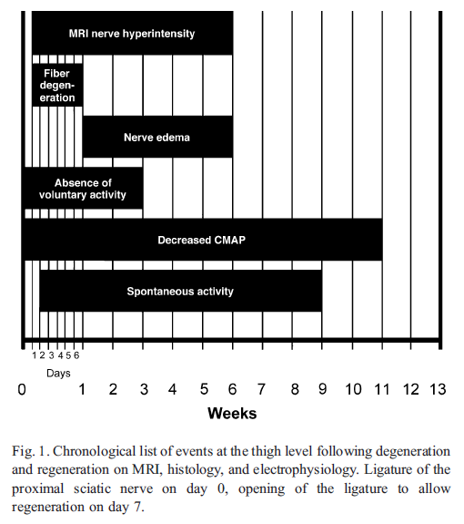
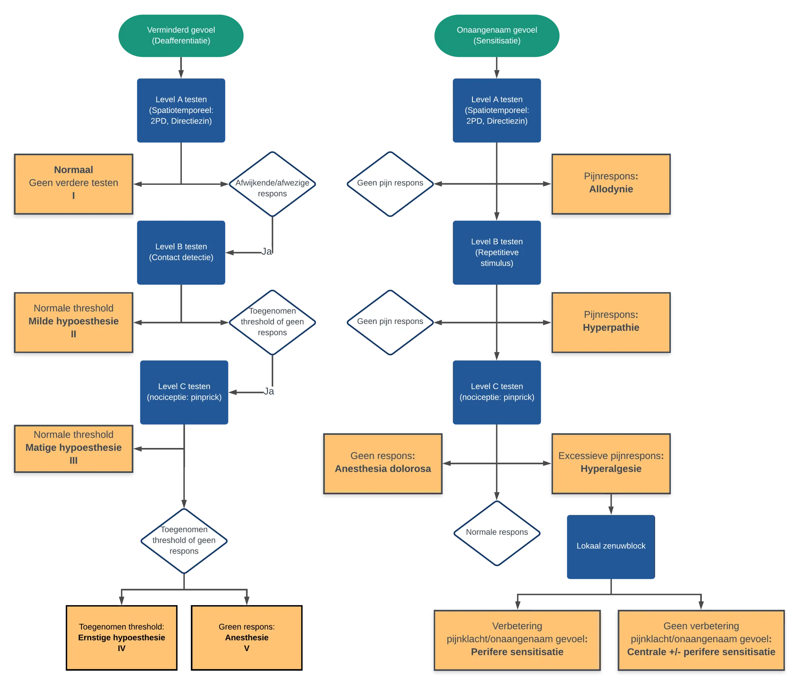

# Trigeminus letsels

## Chronologie van degeneratie en regeneratie

{width="500"}

## Neurosensorische testen

|          | **Level A: Spatiotemporal Sensory Perception** | **Level B: Contact Detection with Monofilament** | **Level C: Pain Threshold and Tolerance** |
|----------|------------------------------------------------|--------------------------------------------------|-------------------------------------------|
|          | **Heat Temperature Threshold \<47**            |                                                  |                                           |
|          | **Heat Temperature Tolerance \<50**            |                                                  |                                           |
|          | **Direction Sensitivity \<90%**                |                                                  | **Pressure Pain Threshold \<1.5 lb.**     |
|          | **Static 2-Point Discrimination \<18 mm**      | **\<2.83**                                       | **Pressure Pain Tolerance \<2.0 lb.**     |
| Normal   | Present                                        | Present                                          | Present                                   |
| Mild     | Failed                                         | Present                                          | Present                                   |
| Moderate | Failed                                         | Failed                                           | Present                                   |
| Severe   | Failed                                         | Failed                                           | Elevated                                  |
| Complete | Failed                                         | Failed                                           | Absent                                    |

## Neurosensorische flowchart

```{r echo=FALSE, fig.cap='QST Flowchart'}

```

+-----+---------------------------------------------------------------------------------------------------------------------------+
| S0  | Afwezigheid van gevoel in het autonome gebied van de zenuw                                                                |
+:====+:==========================================================================================================================+
| S1  | Herstel van diepe cutane pijn en tactiele gevoeligheid                                                                    |
+-----+---------------------------------------------------------------------------------------------------------------------------+
| S1+ | Herstel van oppervlakkige pijngevoeligheid                                                                                |
+-----+---------------------------------------------------------------------------------------------------------------------------+
| S2  | Herstel van een zekere mate van oppervlakkige cutane pijn en tactiele gevoeligheid                                        |
+-----+---------------------------------------------------------------------------------------------------------------------------+
| S2+ | Zoals in S2, maar met een overdreven reactie                                                                              |
+-----+---------------------------------------------------------------------------------------------------------------------------+
| S3  | Terugkeer van pijn en tactiele gevoeligheid met verdwijnen van overrespons, statische 2PD\>15mm, bewegende 2PD\>7mm       |
+-----+---------------------------------------------------------------------------------------------------------------------------+
| S3+ | Terugkeer van gevoel zoals in S3 met enig herstel van tweepuntsdiscriminatie, statische 2PD: 7-15mm, bewegende 2PD: 4-7mm |
+-----+---------------------------------------------------------------------------------------------------------------------------+
| S4  | Volledig herstel, statische 2PD: 2-6mm, bewegende 2PD: 2-3mm                                                              |
+-----+---------------------------------------------------------------------------------------------------------------------------+

: MRCS

## Correlatie van Sunderland - NST - Chirurgie - MRN

| **Sunderland Classification** | **Clinical NST Level and MRCS Grade Description** | **Surgical Findings by Direct Inspection**                                                                                                                                 | **MRN Findings**                                                                                                  |
|-------------------------------|---------------------------------------------------|----------------------------------------------------------------------------------------------------------------------------------------------------------------------------|-------------------------------------------------------------------------------------------------------------------|
| I                             | Normal (4)/S3+ or S4 by 3 mo                      | Intact with no internal or external fibrosis, normal mobility, and neuroarchitecture (visualized fascicles and Fanconi bands)                                              | Anatomic: homogenous, mild increased T2W nerve signal                                                             |
| II                            | Normal (4)/S3+ or S4 by 6 mo                      | Intact with no internal fibrosis; external fibrosis, restricted mobility, but neuroarchitecture intact (visualized fascicles and Fanconi bands once external scar removed) | Anatomic: homogenous increased T2W signal of nerve and mild nerve thickening or constriction; perineural fibrosis |
| III                           | Mild (3) or moderate (2)/S2, S2+, S3 by ≥6 mo     | Intact with both internal and external fibrosis, restricted mobility, and disturbance of neuroarchitecture (abnormal fascicle patterns and/or Fanconi bands not visible)   | Anatomic: homogenous increased T2W signal of nerve and moderate thickening or constriction; perineural fibrosis   |
| IV                            | Moderate (2) or severe (1)/S1, S2, S2+ by ≥6 mo   | Partially transected nerve but some amount of distal nerve present with or without neuroma in continuity                                                                   | Anatomic: heterogeneous T2W signal of nerve and neuroma in continuity; perineural and intraneural fibrosis        |
| V                             | Severe (1) or complete (0)/S0, S1 by ≥6 mo        | Completely transected nerve with or without amputation neuroma                                                                                                             | Anatomic: discontinuous nerve with end-bulb neuroma                                                               |

## Stratificatie op basis van MRN en chirurgie

Criteria for stratifying of nerve injuries on MRN and surgery based on Sunderland classification

| **Class**                                                                          | **MRN**                                                                                                                                                                 | **Surgical**                                                                                                                                                                  |
|------------------------------------------------------------------------------------|-------------------------------------------------------------------------------------------------------------------------------------------------------------------------|-------------------------------------------------------------------------------------------------------------------------------------------------------------------------------|
| I                                                                                  | Qualitative: Homogeneous increased T2 signal of nerve with no change in caliber                                                                                         | Intact with no internal or external fibrosis, normal mobility and neuroarchitecture (visualize fascicles and Fanconi bands)                                                   |
| Quantitative: No changes                                                           |                                                                                                                                                                         |                                                                                                                                                                               |
| II                                                                                 | Qualitative: Homogeneous increased T2 signal of nerve and mild nerve thickening Perineural fibrosis                                                                     | Intact with no internal fibrosis with external fibrosis, restricted mobility but neuroarchitecture intact (visualized fascicles and Fanconi bands once external scar removed) |
| Quantitative: \<50% larger than contralateral /normal nerve                        |                                                                                                                                                                         |                                                                                                                                                                               |
| III                                                                                | Qualitative: Homogeneous increased T2 signal of nerve and moderate to marked nerve thickening Perineural fibrosis                                                       | Intact with both internal and external fibrosis, restricted mobility and disturbance of neuroarchitecture (abnormal fascicle patterns and/or Fanconi bands not visible)       |
| Quantitative: \>50% larger than contralateral/normal nerve                         |                                                                                                                                                                         |                                                                                                                                                                               |
| IV                                                                                 | Qualitative: Heterogeneous increased T2 signal of nerve and focal enlargement in otherwise continuous nerve (neuroma in continuity) Perineural and intraneural fibrosis | Partial transected nerve, but some amount of distal nerve present with or without lateral neuroma                                                                             |
| Quantitative: Focal swelling with heterogeneous T2 signal or fascicular disruption |                                                                                                                                                                         |                                                                                                                                                                               |
| V                                                                                  | Qualitative: Discontinuous nerve with end-bulb neuroma                                                                                                                  | Completely transected nerve with or without amputation (end-bulb) neuroma                                                                                                     |
| Quantitative: Complete disruption with gap and end-bulb neuroma                    |                                                                                                                                                                         |                                                                                                                                                                               |

## MRN bevindingen case verus control IAN-LN-schade

Differences in thickness, T2SIR, and CNR among the case and control groups

+---------------------+-----------+-------------------+---------------------+--------------+
| **Nerve**           | **Group** | **Thickness**     | **T2SIR**           | **CNR**      |
+=====================+===========+===================+=====================+==============+
| **Mean Difference** | **SD**    | ***P*** **Value** | **Mean Difference** | **SD**       |
+---------------------+-----------+-------------------+---------------------+--------------+
| IAN                 | Cases     | 0.60              | 0.33                | .01          |
+---------------------+-----------+-------------------+---------------------+--------------+
| Controls            | 0.22      | 0.20              | 1.34                | 1.09         |
+---------------------+-----------+-------------------+---------------------+--------------+
| LN                  | Cases     | 0.87              | 0.34                | .0001        |
+---------------------+-----------+-------------------+---------------------+--------------+
| Controls            | 0.11      | 0.12              | 1.92                | 1.51         |
+---------------------+-----------+-------------------+---------------------+--------------+

 
