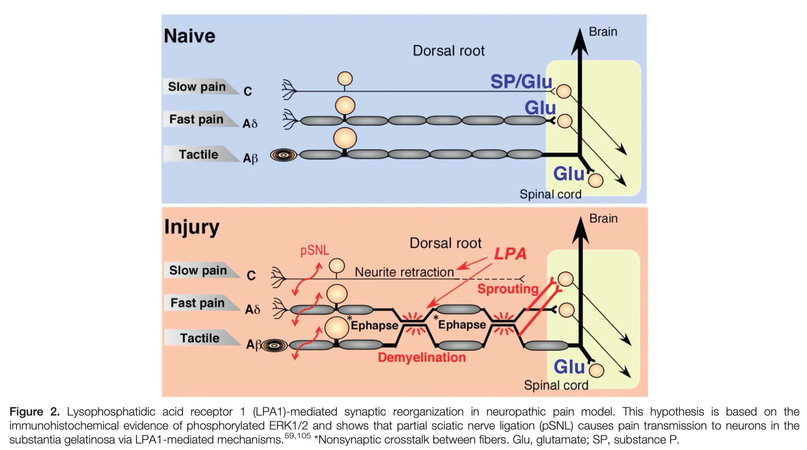

# Orofaciale pijn

## Inleiding

](https://i0.wp.com/omfs.academy/OMFS%2520Images/Laure%2520Molecular%2520Pathways%2520Trigeminal%2520Nerve.png?resize=1366%252C1024)

## Perifere mechanismen

## Centrale Mechanismen

## Classificaties en Taxonomie

## Behandeling

### Medicaties

### Chirurgische opties

## Informatie voor patiënten

## Dentogene pijn

-   Cfr. andere hoofdstukken, voornamelijk pulpitis en periodontitis

-   Pulpitis

    -   cariës van glazuur en dentine met ontsteking van de pulpa

    -   soms geen cariës maar

        -   toxiciteit van vullingsmateriaal (esthethische)

        -   trauma op tanden

        -   parodontolyse

    -   symptomen

        -   pijn

            -   door warmte, koude, zuur, zoet

            -   heviger dan bij graad II cariës

            -   invloed van temperatuur is wisselend

            -   soms in beginstadium kan koude de pijn verminderen door afname van pulpacongestie

            -   terminaal stadium: gevoeligheid voor warmte neemt toe, geen gevoeligheid meer voor koude, zuur, zoet

            -   karakteristiek spontane pijn buiten de maaltijd of prikkel van warmte/koude

    -   kenmerken

        -   begin

            -   zonder aanleiding of door impactie van voedsel of door liggende houding ('s nachts)

            -   er ontstaat compressie van gecongestioneerde pulpa binnen rigide pulpakamer

            -   bij neerliggen stijgt bloeddruk ⇒ meer stuwing ⇒ pijndrempel overschreden

        -   duur

            -   wisselend, tiental minuten tot uren

            -   verdwijnt even plots als bij ontstaan (eventueel door drinken water, analgetica,...)

            -   verloop over 3-tal weken waarna pulpanecrose door afsnoering apicale vaten

        -   karakter

            -   zeer hevig opschietend met aanhoudende achtergrondspijn

            -   straalt uit in ganse gelaatshelft

            -   moeilijk lokaliseerbaar in causale tand

            -   bij ondermolaren/premolaren uitstraling naar oor

            -   bij bovenmolaren/premolaren uitstraling naar de slaapstreek

        -   objectief

            -   cariësholte, dubieuze vulling, diepe parodontolyse

            -   pijnloos bij percussie tenzij terminale pulpitis

            -   vitaliteit: toegenomen gevoeligheid voor warmte/koude

            -   in terminale stadium neemt gevoeligheid voor warmte toe door uitzetting van gassen in pulpakamer met druk op reeds oedeme pulpa

            -   gevoeligheid voor koude neemt af in terminale stadium

    -   RX

        -   geen afwijking zichtbaar behalve soms cariës

    -   DDx

        -   trigeminusneuralgie

        -   vasculosympathische pijn

        -   cardiale pijn

    -   Evolutie

        -   na dagen tot enkele weken valt pijn weg = pulpanecrose

## Acute periodontitis

-   Aansluitend op pulpitis of op later tijdstip

-   Symptomen

    -   diepe, kloppende pijn, goed lokaliseerbaar, eventueel met uitstraling

    -   dag en nacht pijn en neemt toe in subperiostaal stadium

    -   afname pijn na doorbraak door periost

    -   elke druk op tand (kauwen) is pijnlijk, soms gevoel dat tand omhoog is gekomen

-   Objectief

    -   tekenen van pulpanecrose

    -   blauwgrijze verkleuring tandkroon

    -   cariës of tandvulling

    -   achtergebleven wortel

    -   zwelling en roodheid zodra etter periostaal zit

    -   percussie zeer pijnlijk 

    -   vitaliteit is negatief

## Parodontale pijn

-   S/

    -   kan uitbreiden tot aan de apex en aanleiding geven tot pulpitispijn (retrograde pulpitis)

        -   eerder uitzonderlijk

    -   meestal doffe zeurende pijn, ganse dag aanwezig

    -   moeilijk te lokaliseren, wel bij axiale of laterale druk

-   Klinisch: tekenen van parodontitis

    -   pockets

    -   tandmobiliteit

    -   gingivitis

-   Rx

    -   wortelresorptie

    -   verbrede PDL spleet

## Neuralgieën

-   S/

    -   pijnsyndroom met intermittende pijn in gebied van een zenuw zonder uitvalsverschijnselen

    -   neuropathie: aandoening van perifere zenuw met uitvalsverschijnselen soms met pijn door uit balans raken van sensibele afferente impulsen = deafferentiatiepijn

        -   treedt op bij lichte aanraking: brandend, prikkend, jeukend

    -   hyperpathie:

        -   één pijnprikkel wordt minder waargenomen

        -   reeks fysiologische pijnprikkels geeft sommatie en uitbreiding buiten gebied van aanraking

-   Craniale neuralgieën

    -   trigeminusneuralgie

    -   postherpes trigeminusneuralgie

    -   glossopharyngeus neuralgie

    -   neuralgie van n. laryngeus superior

### Trigeminus neuralgie

-   Algemeen

    -   paroxystische pijn op traject van 1 of meer takken van n. trigeminus

    -   meestal unilateraal en opgewekt door prikkeling van zone 

    -   na tandpijn, 2e meest frequente oorzaak van hevige pijn in gelaat

    -   vaak nutteloze extracties door foute diagnose

-   Voorkomen

    -   meestal 50-60 jaar, indien 30-40 jaar denk aan MS

    -   meer bij vrouwen dan mannen

    -   rechts meer dan links

    -   geen familiaal voorkomen, niet erfelijk

-   Etiologie

    -   meestal geen duidelijke oorzaak = idiopathische/essentiële trigeminusneuralgie

    -   twee mogelijke verklaringen

        -   

            1)  demyelinisatie theorie

            -   demyelinisatie wijzigt activiteit pijnvezels dorsale wortel ⇒ tactiele gewaarwording wordt overgebracht als pijnprikkel

        -   

            2)  vasculaire compressie theorie

            -   druk van kleine arteries op trigeminusradix op plaats van intrede in de hersenstam

    -   indien organische oorzaak = symptomatische trigeminusneuralgie

    -   lokaal: 

        -   druk door gezwel/aneurysma in fossa posterior

        -   ontsteking: sinusitis, meningitis, tandontsteking

    -   algemeen

        -   multiple sclerose

        -   1,5% van MS patiënten hebben trigeminusneuralgie = 300x de frequentie van de gehele populatie

        -   3% van patienten met trigeminusneuralgie hebben MS

        -   frequentie van bilaterale aantasting is dubbel zo groot als bij andere oorzaken

        -   in 80-90% gaan symptomen van MS vooraf aan de trigeminusneuralgie maar kan ook omgekeerd

        -   gelijkaardig aan de gewone vorm maar frequenter bilateraal, remissieperioden na behandeling zijn korter

        -   gedemyeliniseerde laesies in de root entry zone

    -   arteriosclerose

    -   intoxicatie (lood, alcohol, arsenicum)

    -   overspanning

    -   diabetes

    -   zona

-   Symptomen

    -   plotse aanvallen van zeer hevige pijn gedurende enkele seconden en gedurende aantal minuten zijn er salvo's

    -   kan vele malen per etmaal voorkomen

    -   tussenin volledig pijnvrij

    -   meestal unilateraal en opgewekt door prikkeling in electieve zone

    -   stekend, snijdend of elektrisch van aard

    -   volgens de takken van de n. trigeminus en kruist middellijn niet

    -   kan 1 tak zijn, maar kunnen ook meerdere takken zijn

    -   in dalende volgorde: n. infraorbitalis, n. mentalis, n. buccinatorius, n. auriculotemporalis, n. frontalis, n. zygomaticofacialis

    -   meestal 1 zijde van het gelaat

    -   aantal aanvallen/dag: aantal tot vele

    -   soms pijnloze intervallen van maanden tot jaren

    -   spontaan herstel zeldzaam

    -   vaak evolutie naar aantasting van meerdere takken en afname van pijnloze periodes

    -   uitgelokt door beweging of druk: spreken, wassen, scheren, eten,...

    -   vaak hypergevoelige zone (rond neus, mondhoek) = trigger zone

    -   vaak verstarde gelaatsuitdrukking omdat ze gelaat zo weinig mogelijk proberen te bewegen om uitlokken te voorkomen

    -   soms pijn gepaard met samentrekking van spieren = tic douloureux

    -   soms gepaard met tranen van ogen, hypersalivatie

-   Klinisch onderzoek

    -   opzoeken trigger zones (uitmonding van zenuw = Valleix punten)

    -   foramen infraorbitale

    -   foramen mentale

    -   grens mediaal en middelste derde van wenkbrauw

    -   meestal geen stoornis in gevoeligheid, geen verlies van corneareflex

    -   causale laesies opsporen

    -   Rx van sinussen, CT/NMR van hersenen

-   Verloop

    -   zware morele belasting en soms neiging tot zelfmoord

    -   goedaardig, geen levensverkorting

    -   aantasting van meerdere takken en pijn minder beïnvloed door vernietiging perifere zenuwtakken

-   DDx

    -   pulpitis

        -   pijnaanvallen duren langer en verdwijnen door necrose 

        -   nachtelijke pijn door platliggen, bij TN is er bijna nooit nachtelijke pijn waarschijnlijk door tekort aan stimulatie van de trigger points gedurende de slaap

    -   pijn na zona

        -   anamnestisch: blaasjes in gebied van pijn

        -   vaak in gebied n. ophthalmicus

        -   gevoelsvermindering in aangetast gebied

        -   corneareflex afwezig

    -   vasculaire pijn (syndroom van Horton)

        -   aanvallen duur paar uur en t.h.v. diepte van oogkas

        -   geen radiculair verloop van de pijn

        -   sympaticus symptomen: unilaterale neuscongestie, roodheid huid, epiphora tijdens pijnaanval

        -   einde van aanval vaak gepaard met neusloop

-   Behandeling

    -   medicamenteus

        -   carbamazepine (Tegretol)

            -   hoeksteen

            -   dosis 300-1200 mg/dag

            -   nevenwerking: duizeligheid, nausea

            -   gevaar voor aplastische anemie, lever en nierfunctie

            -   allergische nevenwerkingen

            -   60-90% ondervindt volledige pijncontrole, vaak resistentie na jaren

        -   baclofen (Lioresal)

            -   antispasmodicum met centrale analgetische werking

            -   geen beenmergonderdrukking

            -   startdosis van 3x 10 mg/dag, elke 2 dagen ophogen met 10 mg tot onderdrukking van de pijn

            -   onderhoudsdosis typisch 60 mg/dag

            -   combinatie van Tegretol+Lioresal laat toe Tegretol te minderen in dosis en nevenwerkingen te onderdrukken

        -   phenytoïne (Diphantoine)

            -   langdurige verlichting bij 25% van patiënten

            -   best als adjuvans bij therapie met baclofen

            -   gewone dosis is 300 mg/dag in 3 giften

        -   clonazepam (Rivotril)

            -   minder duidelijk effect/evidence

    -   perifeer chirurgisch

        -   curettage van kaakbeenholten

            -   sommige auteurs melden spectaculaire verbetering, geen bevestiging in latere publicaties

        -   alcoholisatie

            -   vooraf LA geven, want doet heel veel pijn

            -   lokale inspuiting van 95% alcohol

            -   perifeer (foramen mandibulae, mentale, canalis infraorbitalis)

            -   centraal (schedelbasis: foramen rotundum, ovale)

            -   meestal eerst perifeer

            -   volledige gevoelloosheid die 10 maanden duurt

            -   injecties regelmatig te herhalen

            -   pijnloze intervallen worden steeds korter, nadien evt centrale injecties

            -   Praktisch protocol:

                -   Voorverdoven: Spyx met Septanest special \>\> klein volume, aangezien er nog een hoeveelheid alcohol bij moet (risico om te groot volume in weke weefsels te spuiten)

                -   Tuberculine-spuitje van 1ml vullen met Ethanol 96%

                -   Groene naald opzetten

                -   Inspuiten op zelfde wijze als een spyx-verdoving 

                    -   Cave: ALTIJD stevig botcontact tijdens inspuiten, zodoende geen ethanol in de m. pterygoideus medialis te spuiten (kan ernstige verlittekening en trismus geven)

        -   streptomycine/lidocaïne injecties

            -   gunstige resultaten te bekomen

        -   neurexerese

            -   pijnvrij voor ongeveer 3 jaar

            -   kan niet herhaald worden, nadien kan wel alcoholisatie

            -   verschillende technieken voor de NAI beschreven

                -   doorsnijden voor intrede in canalis mandibularis + aan foramen mentale en dan retrograad uittrekken

                -   langs trepanatievenster in buccale corticale plaat vrijleggen en verwijderen

        -   cryotherapie

            -   sinds meer dan 10 jaar gebruikt

            -   zenuw bevriezen met vloeibare stikstof sonde aan -60 tot -- 100°C (-89°C) gedurende 2×3 minuten

            -   70% pijnvrij gedurende 1 jaar, 30% gedurende 2-3 jaar

            -   herhaalbaar

            -   sensibiliteit blijft bewaard

            -   intracraniële transcutane behandeling

        -   coagulatie van ganglion van Gasser (Kirschner operatie)

            -   met lange naald onder radiologische controle doorheen foramen ovale in schedelholte

            -   vernietigen van ganglion met thermocoagulatie

            -   voornaamste verwikkeling: anesthesie van cornea soms met verlies van het oog

            -   soms dysesthesie en anesthesia dolorosa die erger is dan initiële symptomen

            -   mortaliteit zeer laag en goed verdraagbaar bij zelfs oudere patiënten

            -   volledig succes met 1-2 operaties bij 96-100%

            -   recidief bij 5-10%

            -   resultaten minder goed in atypische gevallen met constante achtergrondpijn

        -   injectie van glycerol achter ganglion van Gasser

        -   percutane compressie van ggl. trigeminale en wortel

        -   microvascualire decompressie van trigeminusradix in ponto-cerebellaire hoek

        -   rhizotomie in achterste fossa

### Glossopharyngeus neuralgie

-   Algemeen

    -   zeer zeldzame neuralgie in de farynx, tonsillen, achterzijde tong, oor

    -   gelijkenis met trigeminusneuralgie

-   Symptomen

    -   paroxysmaal, zeer hevig, kortdurend

    -   begint in keel en tongbasis en straalt uit naar het oor

    -   ontstaat door slikken, kauwen, hoesten, geeuwen, niezen, spreken, soms door aanraken van amandel

    -   zeker zijn dat er geen tumor is van tonsil of farynx

-   Behandeling

    -   carbamazepine (Tegretol) redelijk doeltreffend

    -   indien Tegretol niet helpt, dan groot probleem want zowel intra- als extracranieel zeer moeilijk bereikbare zenuw

### Postherpetische neuropathie

-   Algemeen

    -   na herpes zosterinfectie meestal tak van de n. trigeminus

    -   bij 10% van de patiënten, voornamelijk ouderen

-   Symptomen

    -   deafferentiatie pijn in aangedane huidgebied

    -   50% heeft na 3 maand nog pijn, 30% na 1 jaar

    -   pijn kan continu zijn, verergerend door aanraken, paroxysmaal

-   Behandeling

    -   lage dosis amitryptilline hydrochloride eventueel in combinatie met phenothiazines geven beste resultaat

### Eagle syndroom (stylalgia)

-   Algemeen

    -   processus styloideus t.h.v. schedelbasis, normale lengte 2-3 cm, in verlengde lig. stylohyoideum (hecht aan op cornu minor van hyoid)

    -   bij 4% gedeeltelijk/geheel verkalkt

-   Symptomen

    -   bij 4% van mensen met verlengde styl. zouden er symptomen van stylalgie zijn

    -   vanaf 7,5 cm is deze palpeerbaar

    -   pijn in verschillende vormen/lokalisaties

    -   last kan bestaan uit doffe pijn en moeite met slikken

    -   gevoel van vreemd lichaam in de keel

    -   in andere gevallen scherpe schietende pijn die doet denken aan glossopharyngeus neuralgie

-   Behandeling

    -   resectie ligament (intra of extra-orale approach)

    -   soms recidief dus diagnostiek moet goed zijn

### Carcinoom

-   Pijnloos ulcus of tumor met pijn in laattijdig stadium behalve bij tongbasis/hypofarynx/mondbodem daar vaak vroegtijdig pijn

-   Onderzoek soms moeilijk door spierspanning

-   Pijn uitstralend naar oor en verharde klier aan carotisbifurcatie zijn vaak eerste symptomen

### Kanker-behandeling geassocieerde pijn in de mond

-   Behandeling van kanker buiten de mond kan pijn geven in de mond

-   Vincristine

    -   kan orale mucositis geven, orale candidiasis, neurotoxiciteit + pijn

-   Oxaliplatine = cytostaticum voor metastatische colorectale kanker

    -   neurotoxisch, perifere paresthesieën, soms irreversibel

    -   bij 70% dysesthesieklachten in gelaat en frequent ook pijn in de kaak

-   Radiotherapie/chemotherapie

    -   orale mucositis met hevige pijn

    -   osteoradionecrose

-   Beenmergtransplantatie

    -   orale mucositis met pijn

-   Bisfosfonaten, denosumab

    -   parenteraal bij botmetastasen

    -   pijnlijke osteonecrose

## Sinusitis

-   Sinusitis maxillaris bij

    -   pijn gelokaliseerd rond een van de maxillaire sinussen

    -   verergert bij bukken

    -   gepaard met koorts

    -   gepaard met neusverkoudheid

-   Klinisch

    -   percuteer en palpeer de sinus

-   OPG en CBCT:

    -   vochtniveau's of sluiering

    -   processus uncinatus of ostium open?

-   Verder nazicht via NKO

## Intracraniële oorzaken van pijn

-   Meestal hoofdpijn, geen gelaatspijn

-   Uitzondering: tumoren van pons/fossa posterior met compressie/irritatie van craniële zenuwen (n. trigeminus)

-   In later stadium overdruksymptomen: hoofdpijn, projectiel braken

## Trigeminale autonome cephalalgieën (TAC's) of vasculosympatische pijn

-   Cluster headache

-   Synoniemen: syndroom van Horton, migraineuze neuralgie, histamine cephalalgie, vasculosympatische pijn

-   Recurrente aanvallen van hevige kloppende unilaterale hoofdpijn, meestal diep in oogkas/maxilla gelokaliseerd

-   Voorkomen

    -   zeer zeldzaam

    -   meestal tussen 20-40 jaar

    -   mannen frequenter (5:1)

    -   geen erfelijkheid

    -   geen hogere incidentie van migraine bij deze patiënten

    -   patiënten hebben vaak stresserende job

    -   velen zijn zware rokers met hoog alcohol gebruik

-   Etiologie

    -   rol histamine bij uitlokken aanval onduidelijk

    -   gedurende aanvallen verhoogde histamine-waarden in bloed/urine

    -   antihistaminica geen invloed op verloop

    -   vasodilatatie in eindtakken carotis (a. maxillaris, a. ophtalmica) als oorzaak

    -   vasodilatoren lokken pijn uit

    -   pijnverlichting door vasoconstrictoren

    -   thermografie en doppler tonen dilatatie tijdens aanval

-   Symptomen

    -   hevige unilaterale pijn

        -   gelokaliseerd rond oog en uitstraling naar de wang, voorhoofd en slaapstreek

        -   spontaan begin en abrupt, onuitstaanbaar hevig aanhoudend 

    -   1-3 of meer aanvallen per dag op dezelfde tijdstippen van dag/nacht

        -   duren kwartier tot een paar uur

        -   aanvallen 's nachts, paar uur na inslapen, waardoor wakker worden (dit is nooit bij trigeminusneuralgie)

    -   neusobstructie aan pijnlijke zijde, neusloop bij einde van de aanval

    -   parasympatische hyperactiviteit

        -   ipsilateraal tranend oog

        -   roodheid van oogbol en wangen

        -   zweten

    -   partieel syndroom van Horner tijdens aanval: ptosis, miosis en raar genoeg hyperhydrosis van ipsilateraal voorhoofd

    -   fotofobie, nausea zijn zeldzaam (itt migraine)

    -   periode van aanvallen duurt 2-6 weken (cluster) waarna maanden tot jaren zonder pijn

        -   naarmate recidieven vorderen steeds meer chronisch zonder remissies

        -   aanvallen verminderen in hevigheid en kunnen volledig verdwijnen met verouderen

    -   alcohol en andere stoffen lokken aanval uit tijdens pijn-fase, dit is niet zo in periode van remissie

    -   verhoogde incidentie van duodenum-ulcus

-   Differentieel diagnose

    -   typisch cyclisch patroon is vrij duidelijk voor diagnose

    -   trigeminusneuralgie en pulpitis benaderen pijnaanvallen qua hevigheid maar niet zo kenmerkende eigenschappen

    -   migraine en arteritis temporalis hebben duidelijk verschillend pijnritme en andere lokalisatie

-   Behandeling

    -   medicamenteus

        -   korte behandeling corticoïden en temperen dosis

        -   calciumantagonisten (Sibelium) als profylaxe

        -   vasoconstrictoren: ergotamine (Dihydergot), pizotifen (Sandomigran), oxertorofumaraat (Nocertone), methysergide (Deseril)

            -   tijdens aanval weinig nut door plots begin en korte duur aanval

        -   aerosol ergotaminetartraat of SC of IV dihydroergotaminemesylaat

            -   gunstige resultaten

        -   zuurstofinhalatie

            -   gunstige resultaten bij aanval

        -   chronische fase: lithiumcarbonaat

        -   indien geen effect meer van corticoïden of ergotamine: combinaties van producten

        -   andere opties

            -   chloorpromazine (Largactil)

            -   indomethacine (Indocid)

            -   cyproheptadine (Periactin)

            -   antihistaminica geen effect.

        -   indien refractief/zeer hevig eventueem neurochirurgie met elektrostimulatie

    -   chirurgische behandeling

        -   minder betrouwbare resultaten dan bij trigeminusneuralgie

        -   anesthesie wordt moeilijk aanvaard, frequenter anesthesia dolorosa

        -   n\. ophthalmica dus risico op gevoelloosheid van cornea

            -   voorbehouden voor refractaire aan medicamenteuze behandeling met onuitstaanbare pijn

        -   specifieke pijnbanen zijn niet gekend dus vaste volgorde in behandeling aanhouden

            -   proefbehandeling met lidocaïne blok dorsaal van ggl. van Gasser: patiënt vertrouwd maken op reversiebele wijze met therapeutisch resultaat

                -   N.B. patient moet aanval hebben bij uitvoeren block ⇒ patient alcohol doen drinken of nitroglycerinetablet geven

            -   bij gunstige proeftherapie: percutane therapie

            -   rhizotomie van ggl: radiogolven of glycerol

        -   open operatie met craniotomie

            -   indien mislukken andere behandelingen

            -   grotere morbiditeit/mortaliteit

            -   opties

                -   open trigeminus rhizotomie

                -   neurectomie van nervus petrosus superficialis

                -   sectie nervus intermedius

                -   sectie pijntractus craniale zenuwen V, VII, VIII, IX, X in medulla oblongata

-   Syndroom van Sluder

    -   grote gelijkenis met syndroom van Horton

    -   neuralgie van ganglion sphenopalatinum

    -   andere theorie: druk op conchae door neustussenschot

    -   kenmerkend: plots stoppen door verdoving van ggl sphenopalatinum via onderste neusgang

### Samenvatting

+-----------------------------+----------------------+------------------------------+---------------------+---------------------------------------------+
|                             | **Clusterhoofdpijn** | **Paroxysmale hemicrania**   | **SUNCT/SUNA**      | **Hemicrania continua**                     |
+=============================+:=====================+:=============================+:====================+:============================================+
| Geslacht (M:V)              | 3:1                  | 1:1                          | 1.5:1               |                                             |
+-----------------------------+----------------------+------------------------------+---------------------+---------------------------------------------+
| Aanvalsduur                 | 15-180 minuten       | 2-30 minuten                 | 5-240 seconden      | Continu met exacerbaties van uren tot dagen |
+-----------------------------+----------------------+------------------------------+---------------------+---------------------------------------------+
| Aanvalsfrequentie           | 0.5-8 per dag        | 1-40 per dag (gemiddelde 11) | 3-200 per dag       | Continu                                     |
+-----------------------------+----------------------+------------------------------+---------------------+---------------------------------------------+
| Lokalisatie                 | Orbitaal\            | Orbitaal\                    | Periorbitaal\       | Ganse hemicranium                           |
|                             | Temporaal\           | Temporaal\                   | V1\> C2 \> V2 \> V3 |                                             |
|                             | V1\> C2 \> V2 \> V3  | V1\> C2 \> V2 \> V3          |                     |                                             |
+-----------------------------+----------------------+------------------------------+---------------------+---------------------------------------------+
| Karakter                    | Scherp/kloppend      | Scherp/kloppend              | Scherp/kloppend     |                                             |
+-----------------------------+----------------------+------------------------------+---------------------+---------------------------------------------+
| Autonome kenmerken          | Ja                   | Ja                           | Ja                  | Minder uitgesproken\                        |
|                             |                      |                              |                     | Zanderig gevoel ogen                        |
+-----------------------------+----------------------+------------------------------+---------------------+---------------------------------------------+
| Intensiteit                 | Ondraaglijk          | Ondraaglijk                  | Ernstig             | Minder ernstig                              |
+-----------------------------+----------------------+------------------------------+---------------------+---------------------------------------------+
| Circadiaans rithme          | Aanwezig             | Afwezig                      | Afwezig             | Afwezig                                     |
+-----------------------------+----------------------+------------------------------+---------------------+---------------------------------------------+
| Migraineuze kenmerken\      | \                    | \                            | \                   | Zeldzaam                                    |
| - Nausea\                   | 50%\                 | 40%\                         | 25%\                |                                             |
| - Foto/sonofobie            | 65%                  | 65%                          | 25%                 |                                             |
+-----------------------------+----------------------+------------------------------+---------------------+---------------------------------------------+
| Uitlokkende factoren        | Ethyl\               | Soms ethyl                   | Huidaanraking       |                                             |
|                             | Nitroglycerine       |                              |                     |                                             |
+-----------------------------+----------------------+------------------------------+---------------------+---------------------------------------------+
| Episodisch vs chronisch (%) | 90:10                | 35:65                        | 10:90               |                                             |
+-----------------------------+----------------------+------------------------------+---------------------+---------------------------------------------+
| Agitatie                    | 90%                  | 80%                          | 65%                 |                                             |
+-----------------------------+----------------------+------------------------------+---------------------+---------------------------------------------+
| Aanvalsbehandeling effect\  | \                    | \                            | \                   |                                             |
| - Zuurstof\                 | 70%\                 | Geen effect\                 | Geen effect\        |                                             |
| - Sumatriptan 6 mg\         | 90%\                 | 20%\                         | \< 10%\             |                                             |
| - SC indomethacine          | Geen effect          | 90%                          | Geen effect         |                                             |
+-----------------------------+----------------------+------------------------------+---------------------+---------------------------------------------+
| Profylaxe                   | Verapamil\           | Indomethacine                | Lamotrigine\        | Indomethacine                               |
|                             | Methysergide\        |                              | Topiramaat\         |                                             |
|                             | Lithium              |                              | Gabapentine         |                                             |
+-----------------------------+----------------------+------------------------------+---------------------+---------------------------------------------+

## Arteritis temporalis

-   Algemeen

    -   synoniem: reuscelarteritis

    -   uitsluitend boven de 50 jaar

    -   granulomateuze ontsteking van grote en middelgrote arteries op gans lichaam

    -   incidentie: 17 per 100.000

    -   prevalentie 500 per 100.000 voor polymyalgia rheumatica en 133 per 100.000 voor arteritis temporalis

    -   vrouwen drie maal vaker dan mannen

    -   door predilectie voor arteria temporalis ontstond de naam arteritis temporalis, maar is dus eigenlijk systeemaandoening

    -   vaak ook naar Horton genoemd die eerste beschrijving deed in 1932 (verwarring met cluster headache)

    -   relatie tussen polymyalgia en arteritis temporalis is onduidelijk

    -   PR is frequenter

    -   20% van PR patiënten hebben ook AT

    -   ongeveer 50% van AT patiënten hebben gelijktijdig PR

-   Anatomopathologie

    -   inflammatie van enkel grote en middelgrote arteries

        -   meest uitgesproken in de media en gefragmenteerde lamina interna

    -   granulaties met T-lymfocyten, histiocyten en reuscellen

    -   obstructie van lumen door oedeem en fibreuze proliferatie van intima met ischemie en eventueel necrose

    -   geen uniforme aantasting maar segmentair (skip lesions) waardoor valsnegatieve biopsies

    -   bij hevige hoofdpijn + gezwollen pijnlijke arterie volstaat kleine biopsie

    -   bij klinisch negatieve arterie aan te raden uitgebreid fragment (5 cm) te nemen

-   Etiologie en pathogenese

    -   ongekend maar wellicht cel-gemedieerde immuunrespons

-   Symptomen

    -   lokaal

        -   afhankelijk van aangetaste arteries

            -   a\. carotis, temporalis, lingualis, facialis, occipitalis, ophthalmica

        -   hoofdpijn temporaal

        -   soms occipitale hoofdpijn, veralgemeende hoofdpijn is zeldzaam

            -   beschreven als jeukend, brandend

        -   pijnlijke gezwollen a. temporalis, gevoelig bij palpatie

        -   pijn in kaken bij kauwen/spreken = claudicatio van kauwspieren

            -   ischemie van masseterspier 

            -   pathognomonisch

        -   minder frequent: oorpijn, heesheid, keelpijn

        -   pijn, claudicatio, zwelling van tong kan periodisch

        -   cases met necrose van de tong

        -   voorbijgaande gezichtsstoornissen: amaurosis fugax = alarmsymptoom

            -   kan definitieve blindheid geven

        -   voorbijgaande diplopie door ischemie van oogspieren of de zenuwen

        -   aantasting coronairen of intracraniele bloedvaten (CVA) zeldzaam

        -   perifere zenuwsyndromen zeldzaam

        -   soms claudicatio van de arm 

        -   soms unilateraal raynaud fenomeen of afwezige pols

    -   Algemeen

        -   verhoogde sedimentatie

        -   koorts

        -   anorexie

        -   anemie

        -   moeheid

        -   gewichtsverlies

        -   gestoorde levertesten (alkalische fosfatasen)

        -   symptomen van polymyalgia rheumatica

            -   bilaterale stijfheid en pijn in nek, schouder en bekkengordel

            -   vooral stijfheid 's ochtends

        -   plots ontstaan + goede respons op prednisone = karakteristiek voor PR

-   Diagnose

    -   verhoogde sedimentatie

    -   zekerheid via biopsie van a. temporalis

        -   goede betrouwbaarheid

        -   NPV van 91%

        -   voldoende grote biopsie belangrijk, eventueel tweede biopsie contralateraal bij negatieve eerste biopsie

-   Evolutie en prognose

    -   belangrijkste complicatie: ischemische neuritis optica eventueel zelfs blindheid

    -   meestal reeds 2-5 maand symptomen voor er blindheid optreedt

    -   vroegtijdige diagnose uiterst belangrijk

    -   zeer goede respons op corticoïden

    -   meestal onderhoudstherapie gedurende een paar jaar

-   Behandeling

    -   begindosis van 50 mg prednisolone 

    -   afbouwen dosis wanneer symptomen verdwijnen

    -   kliniek primeert op sedimentatie

## Glossodynie

-   Paresthesieën van mondmucosa (glossodynie, burning mouth, orale dysesthesie)

-   Frequent bij oudere vrouwen na menopauze

-   T.h.v. tong, prothesedragende mucosa bovenkaak, binnenzijde onderlip

-   Talrijke oorzaken

    -   psychologisch: angst, cancerofobie

    -   prothesen

    -   contact-allergie op methylmethacrylaat monomeer, onstabiele occlusie (overdreven druk/wrijving op mucosa), prothese plaque met bacteriële en Candida-accumulatie

        -   25-30% van prothesedragers met glossodynie hebben positieve patch test

        -   vermoeden van allergie indien

            -   coïncidentie tussen optreden branderig gevoel en dragen prothese

            -   lokalisatie beperkt tot prothese-dragende mucosa

    -   algemene oorzaken

        -   menopauze

        -   diabetes (minder resistente mucosa, frequente xerostomie, Candida-besmetting)

        -   deficiënties (ijzer, vitamine B, foliumzuur, vitamine B2, B6)

        -   steatorrhea

        -   xerostomie 

    -   medicatie (tranquilizers, antidepressiva)

    -   Sjögren

    -   andere oorzaken

        -   antibiotica

        -   mondspoelmiddelen

-   Behandeling

    -   vaak ontgoochelend

    -   vitamine B supplementen (placebo-effect?)

    -   hormonale substitutie zelden beterschap (bij vrouwen na menopauze bij 18-25% glossodynie)

    -   gunstig met

        -   antidepressiva (Prothiaden)

        -   nadeel: gewichtstoename en toename xerostomie

            -   Prothiaden geven we niet meer want gewichtstoename van 10-20 kg die je er niet meer vanaf krijgt bij postmenopauzale vrouw

    -   clonazepam (Rivotril)

    -   alfa-liponzuur (LiponixX)

    -   geruststelling en psychologische begeleiding

## Hoofdpijn

-   Anamnese

    -   duur en verloop

        -   wanneer en hoe begonnen?

        -   constant of in aanvallen?

        -   pijn bij wakker worden of optreden in loop van de dag?

        -   wordt de pijn erger?

        -   hoelang duurt een aanval?

        -   voelt u de aanval aankomen?

        -   treden aanvallen op in weekends/vakanties?

        -   kan er een oorzaak zijn?

    -   plaats

        -   waar heeft u de meeste pijn?

    -   aard

        -   stekend

        -   kloppend of bonzend

        -   drukkend

        -   beïnvloedende factoren

        -   wordt de pijn erger

        -   bij inspanning

        -   emoties

        -   bukken

        -   fel licht

        -   lezen

        -   TV kijken

        -   tijdens menstruatie

    -   wordt de pijn minder erg

        -   innemen van pijnstillers of andere medicaties

        -   goede nachtrust

        -   massage van nekspieren

    -   bijkomende klachten en verschijnselen

        -   lichtflitsen

        -   plots slechter zicht

        -   tintelingen in gezicht, armen of benen

        -   verlammingen of krachtverlies in armen of benen

        -   bijzondere geur

        -   tijdens aanval

            -   lichtschuwheid

            -   slechter zicht

            -   overgeven

            -   trandend, rood oog

            -   loopneus

            -   krachtverlies van armen of benen

            -   duizeligheid

            -   oorsuizen

            -   dubbelzien

        -   koorts

        -   elders pijn behalve in hoofd

    -   hoofdpijn in de familie

    -   medicijngebruik

    -   gebruik van alcohol/drugs

    -   vroegere ziekten, opnames, operaties

    -   psychoproblematiek (respect voor patient)

## Migraine

-   Anamnestisch

    -   aanvalsgewijs

    -   vooral in weekend/vakanties/tijdens menstruatie

    -   voelt aanval komen met prodromen (lichtflitsen, slecht zien, tingelingen, verlammingen)

    -   misselijkheid en braken

    -   lichtschuwheid

    -   familiaal voorkomen migraine

-   Klinisch geen bijzondere bevindingen

## Spanningshoofdpijn

-   Anamnese

    -   continu aanwezig

    -   vanuit nek naar voorhoofd

    -   als een band rond het hoofd

    -   na spanning of emoties

    -   na lang lezen of TV kijken

    -   afhankelijk van houding (ontspannen gaan liggen doet pijn verminderen)

-   Klinisch

    -   druk met duim+wijsvinger t.h.v. occiput bij aanhechting van m. trapezius

    -   druk t.h.v. mastoid links en rechts, indien dit meer pijn doet dan t.h.v. occiput dan is het geen spanningshoofdpijn, druk t.h.v. trapezius is pijnlijker

    -   bepaal visus

    -   een niet gecorrigeerde refractieafwijking kan spanningshoofdpijn veroorzaken

## 
