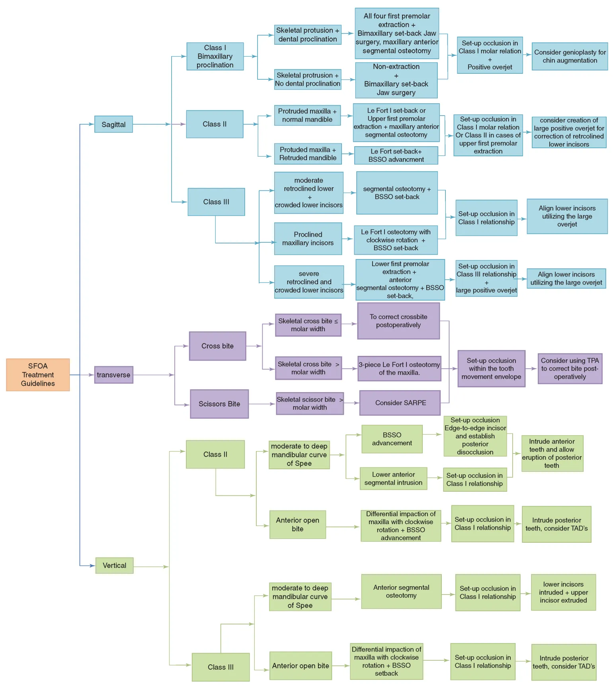

# Orthognathische chirurgie
## Arnett 
### Orientatie
Nooit volume-orientatie volgens orbital rims/nasal bone/wervelkolom. Wel op basis van maxilla!

- Natural head position door patiënt in eigen ogen te laten kijken in een spiegel. Arnett plaatst 2 puntjes ter hoogte van temple op 2 cm van elkaar om daarmee zijn foto te kunnen ijken in de software.
- Verticale midlijn doorheen philtrum en horizontale doorheen de pupillen
- Canting van maxilla nakijken door latje ter hoogte van hoektandcuspiden en te vergelijken met een loodrechte op de verticale midlijn.
- Yaw is erg moeilijk te beoordelen klinisch. We gaan er vanuit dat deze symmetrisch is. (Is echter vaak niet zo bij syndromale patiënten, na RPE/SARPE, hemimandibulaire elongatie/hyperplasie)

### STCA (soft tissue cephalometric analysis)
- Antero-posterior
- Verticaal
- Angles, planes, incisors
- Face, airway, bite

### Behandelplanning 
#### Stap 1: Correct the inclination of the maxillary incisors
- Maxillary incisors to maxillary occlusal plane (mesiobuccal cusp Mx7 to Mx1 tip) – Dit is orthodontisch werk!
- Normal range: 54°-61°, mean 57°
- Crowding strategies
  - Stripping
  - Extractions
  - Corticotomy
- Mx11 inclination on chin post surgery
  - Proclined: increases chin projection
  - Upright: decreases chin projection
  
#### Stap 2: Correct the inclination of the mandibular incisors
- Mandibular incisors to mandibular occlusal plane (mesiobuccal cusp Md7 to Md1 tip) – Dit is orthodontisch werk!
- Normal range: 60-68°, mean 64°
- Crowding strategies
  - Stripping
  - Extractions
  - Corticotomy
- Md11 inclination effect on chin post surgery:
  - Proclined: decreases chin projection
  - Upright: increases chin projection
  
#### Stap 3: Move the mandible to Class I
- Bilateral sagittal split osteotomy
  - Incisor overbite 3 mm
  - Incisor overjet 3 mm
  - Molar overbite 1.5 mm
- Criteria for BSSO only
  - Normal (93-98°) maxillary occlusal plane
  - Maxillary midline on philtrum
  - No maxillary cant
  - No maxillary yaw
  - Maxillary and mandibular arch form/shapes match
  - No maxillary dualplane
  - Normal airway
  
#### Stap 4: Move the maxillary incisor to its aesthetic position
- Move class I to produce the aesthetic position of the maxillary incisor tip
  - Maxillary incisor exposure: 3 mm
  - ULA to Sn: 4.5 mm
  - Upper lip angle: 12°
  - Upper lip thickness: 13 mm
- Ignore nasal base during this step, focus on upper lip anterior position
- Anteroposterior determinants (from most important to less important)
  - Upper lip projection (ULA-TVL)
  - Upper incisor projection (Mx1-TVL)
  - Upper lip thickness (UL1-ULA)
  - Upper lip angle (TVL-Sn-ULA)
  - Upper lip to nasal tip (ULA-NT)
- Vertical determinants
  - Relaxed lip upper incisor exposure (ULB-Mx1 tip)

#### Stap 5: Correct the occlusal planes
- Rotate up or down – Mx11 tip is center of rotation
- Occlusal plane controls the base of nose and chin projections
- Determinants of the aesthetic occlusal plane
  - Mx OP (MxOP-TVL) – mean: 95°
  - Md OP (MdOP-TVL) – mean: 92°
  - Chin projection (Pog’-TVL) – mean: 2.6 mm
  - Nasal base projection (NB’-TVL) – mean: 9 mm
- If necessary during this step, the entire class I complex can be moved slightly forward changing the aesthetic position of Mx11 tip established in the previous step.
- Flatten OP: increases chin and decreases nasal projection
- Steepen OP: decreases chin and increased nasal projection

#### Stap 6: Reposture soft tissue lips and chin
- Upper lip
  - Thins slightly with advancements
  - Upper lip mirror test predicts thinning (een spiegeltje = 3 mm dik)
  - When a thin lip (ULI to ULA) exists, a VY may be necessary to increase upper lip thickness
- Lower lip
  - Maintain lower lip thickness – it does not thin
  - Reposture the lower lip up and in to contact with the upper incisor edge
- The upper lip is normally anterior to the lower lip by 2-4 mm
- The upper lip is normally thinner than the lower lip by 2-4 mm
- Chin – smooth contour

#### Stap 7: Chin osteotomy
- Chin advancement or retraction for projection and/or shape
- Chin lengthening or shortening for height balance.
- When the lips are full, slightly larger chin protrusion balances.
- When the occlusal plane is normalized chin augmentations greater than 4 mm are rare.
- Anteroposterior chin position determinants:
  - Chin projection (Pog’-TVL) – mean: 3.2 mm
  - Lower lip to chin (LLA-Pog’)
- Vertical chin position determinants:
  - Soft tissue chin height (LLT-Me’) – mean: 49 mm
  - Hard tissue chin height (Md11 tip-Me’)
  - Lower lip to upper lip ratio (Sn-ULB/LLT-Me’)

#### Stap 8: Final corrections
- Controleer overjet-overbite
- Correctie van nasal base (als deze bv te ver naar achter is verplaatst door uw bewegingen. Dit kan je doen door gans complex anteroposterieur te transleren of de occlusal planes samen steeper te maken.

## Stappenplan 3D Virtual Treatment Planning – Swennen
1. Maxillary occlusal cant evaluation & correction (roll)
2. Upper dental midline evaluation & correction
3. Overall evaluation of facial asymmetry after virtual occlusal definition
4. Evaluation & correction of flaring (yaw)
5. Upper vertical incisal position evaluation & correction
6. Upper sagittal incisal position evaluation & correction
7. Profile evaluation & occlusal plane correction (“pitch”)
8. 3D chin position evaluation & correction (roll, yaw and pitch)
9. Patient communication of the individualised 3D virtual treatment plan
10. Final adjustments of the individualised 3D virtual treatment plan

## Behandelplanning Flow chart Chng – Liou
```{r echo=FALSE, out.width = "100%", fig.align="center", fig.cap='Flowchart voor orthognathische behandelplanning'}

```